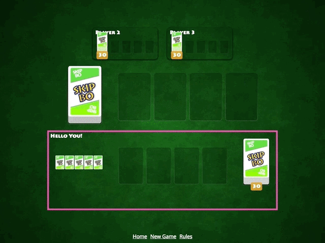

This is about the technical project of our 3-day Angular Advanced Workshop we gave for KaiserX (Allianz) to teach advanced topics of Angular v7 in a unique & playful way by implementing a card game called Skip-Bo. The workshop covered the six chapters, Modules, Components, Routing, RxJS, Testing & Animations, split into theory & challenges. 

<!-- stop excerpt -->

> Note (2021): The concepts are still very valid, even though the version Angular v7 is outdated today.

This week an intense month of planning, preparing & developing an *Advanced Angular Workshop* ended with the workshop itself. Over three days, 15 developers listened to six chapters, each with a theory and a challenge. Every theory part (~1h) is accompanied by a challenge (~2h ) to implement a full card game application. I chose [Skip-Bo](https://en.wikipedia.org/wiki/Skip-Bo) as it's a well-known game, and the rules are easy to grasp.

The workshop was a huge success. I'm so __proud__ of every single participant. They were so focused during my theory part and successfully completed all six chapters 💪 I can tell you those challenges were pretty tricky. I planted nifty bugs to fix. There were RxJS streams to create and animations to build.

## Try it

You can play with the final project online under
[skipbo-angular-workshop.netlify.com](https://skipbo-angular-workshop.netlify.com) and access the complete source & challenges under [github.com/georgiee/angular-workshop-skipbo](https://github.com/georgiee/angular-workshop-skipbo)

Below a gif preview. Additionally, I have prepared a [short video](https://www.youtube.com/embed/xKlta_T3qgs) of the gameplay part on YouTube.

## It's Open Source 🎉
The workshop is Open Source, because we don't want to lock away valuable information — it's about teaching Angular to the community.

We decided to put the workshop on [GitHub](https://github.com/georgiee/angular-workshop-skipbo) and make it Open Source. That way, many more people can go through the workshop on their own. Other fellow developers can even take the workshop and create their own ones too!

We hope you enjoy it.

## Workshop Content
Please check the linked [GitHub project](https://github.com/georgiee/angular-workshop-skipbo) for all details. I will only give a brief summary of the content.

The [workshop project](https://github.com/georgiee/angular-workshop-skipbo) gives you access to all six chapters (theory & challenge). Here the [slides](https://www.slideshare.net/GeorgiosKaleadis/angular-advanced-workshop-challenges) from the workshop.

Inside the project, you will find a git submodule `skipbo-angular` — that's the actual Angular project. This project includes around 50 branches in the following structure.

- workshop/04-rxjs-start
- workshop/04-rxjs-progress-01
- workshop/04-rxjs-progress-02
- workshop/04-rxjs-progress-03
- workshop/04-rxjs-end
- workshop/05-testing-start
- ...

Those branches help struggling participants to quickly catch up. In addition, by creating mandatory branches to check out, I can fast-forward to specific milestones (chapters) without leaving people behind.

The following content lists the chapter introductions for the participants, so you can feel how we proceeded through the workshop.

### Chapter I - Modules
We start slowly with a recap of what Modules are and their special role in Angular. The Injection System is tightly bound to the module world, so it's a good moment to revise them in this chapter.

+ [Theory](https://github.com/georgiee/angular-workshop-skipbo/blob/master/docs/theory/01-modules.md)
+ [Challenge](https://github.com/georgiee/angular-workshop-skipbo/blob/master/docs/challenges/01-modules.md)
+ [Preview](https://5c01159cf6d5ea7fb5133562--skipbo-angular-workshop.netlify.com/)

__Theory__
+ Providers
+ Declarations
+ Imports/Exports
+ EntryComponents
+ Bootstrap
+ Schema

__Challenge__
+ Create our GameService
+ Provide expected interface (TDD)
+ Inject the GameService
+ Break the Injection and fix it
+ Answer a quick question

### Chapter II: Components
Learn about Directive vs. Components, things you can do in templates, ChangeDetection, and the difference between presentational and smart components. In the challenge, we will create our first components and fix a component bug.

+ [Theory](https://github.com/georgiee/angular-workshop-skipbo/blob/master/docs/theory/02-components.md)
+ [Challenge](https://github.com/georgiee/angular-workshop-skipbo/blob/master/docs/challenges/02-components.md)
+ [Preview](https://5c0115b29a063f180bf0dcf5--skipbo-angular-workshop.netlify.com/)

__Theory__
+ Introduction
+ preserveWhitespaces
+ Selectors on existing elements
+ View Encapsulation
+ Smart & Dumb Components
+ OnPush
+ Template References

__Challenge__
+ Create Components
+ Use Gameplay Component
+ Use CardPile Component
+ Fix Bug in the CardPile
+ Inject parent component

### Chapter III: Routing
We will get serious by providing a bunch of new pages like the rulebook, welcome and game over page. In the challenge, you will map routes, introduce lazy loading and routing guards.

+ [Theory](https://github.com/georgiee/angular-workshop-skipbo/blob/master/docs/theory/03-routing.md)
+ [Challenge](https://github.com/georgiee/angular-workshop-skipbo/blob/master/docs/challenges/03-routing.md)
+ [Preview](https://5c01469405c41743336caefd--skipbo-angular-workshop.netlify.com/)

__Theory__
+ Router Outlet
+ Lazy Load
+ Manual Loading a Module
+ Guards
+ Resolver

__Challenge__
+ Route to the new pages
+ Make GameModule lazy load
+ Routing Guards: CanActivate
+ Routing Guards: CanDeactivate with prompt

### Chapter IV: RxJS
Learn the difference between cold & hot, some important rxjs operators and how to test. In the challenge, we will build Oscar 🐙 a card playing AI with the power of RxJS.

+ [Theory](https://github.com/georgiee/angular-workshop-skipbo/blob/master/docs/theory/04-rxjs.md)
+ [Challenge](https://github.com/georgiee/angular-workshop-skipbo/blob/master/docs/challenges/04-rxjs.md)
+ [Preview](https://5c03b6c1e5cd161924fc7252--skipbo-angular-workshop.netlify.com/welcome)

__Theory__
+ Introduction
+ Debugging
+ About Dollar Signs
+ Cold vs Hot Observables
+ Make Cold Observables Hot
+ RxJS in the wild
+ Testing

__Challenge__
+ Redirect to the Gameover Page
+ AI 🐙 Autoplay V1
+ AI 🐙 Autoplay V2
+ AI 🐙 Autoplay V3
+ Stop the AI after game is over

### Chapter V: Testing
This is all about testing. How to enable headless browsers, use hosting/wrapper components and learn important details of the change detection system and how it impacts your testing (tick, fakeSync, micro, macro tasks). In the challenge we will fix a nasty component bug and test Oscar's 🐙 async rxjs stream.

+ [Theory](https://github.com/georgiee/angular-workshop-skipbo/blob/master/docs/theory/05-testing.md)
+ [Challenge](https://github.com/georgiee/angular-workshop-skipbo/blob/master/docs/challenges/05-testing.md)
+ [Preview](https://5c0115fa9a063f180bf0dd48--skipbo-angular-workshop.netlify.com/welcome)

__Theory__
+ Setup
+ Component Testing
+ Micro & Macro Tasks (Theory)
+ Testing Async Code
+ Change Detection
+ Testing Routing

__Challenge__
+ Stock Bug (Investigate) 🐛
+ Stock Bug — Part 1, 2, 3
+ Test RxJS w/ Oscar 🐙 — CPUs
+ Test RxJS w/ Oscar 🐙 — Humans
+ Can Oscar play multiple cards ?

### Chapter VI: Animation
Learn about animations in Angular, how to apply and control them. In the challenge, we will flip some cards 🙌

+ [Theory](https://github.com/georgiee/angular-workshop-skipbo/blob/master/docs/theory/06-animation.md)
+ [Challenge](https://github.com/georgiee/angular-workshop-skipbo/blob/master/docs/challenges/06-animation.md)
+ [Preview](https://5c0115fa9a063f180bf0dd48--skipbo-angular-workshop.netlify.com/welcome)

__Theory__
+ Animation Basics
+ Appear & Disappear
+ Numeric Triggers
+ Disable
+ Router Animations
+ Animate Children

__Challenge__
+ First Flip - Part 1 & 2
+ Flip Party
+ Flip with Style
+ Make the Hand Cards flip
+ Animate Stock Flip

## Conclusion
Preparing a new workshop is time-consuming, especially if you want to craft a unique and challenging experience beyond the typical tutorials. After endless hours of preparations, we were able to deliver and fulfill the expectations. We did not repeat the workshop since then, as we focused on our project-based business, but we are happy to talk about any future possibility if you would like to enjoy a similar experience.
