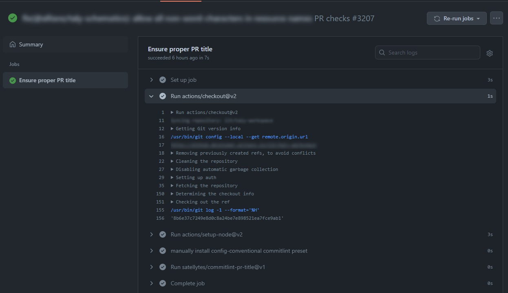
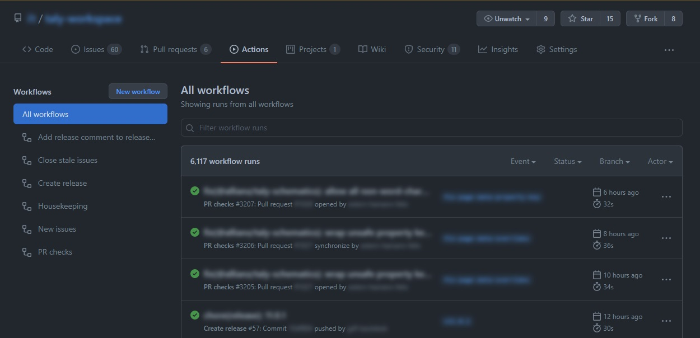
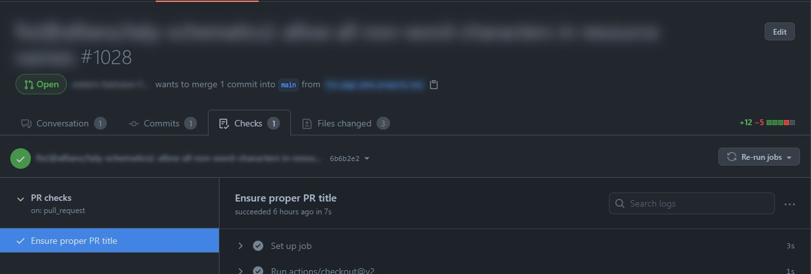
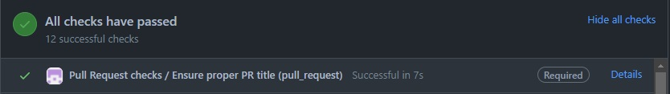
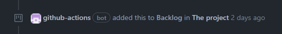
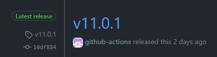
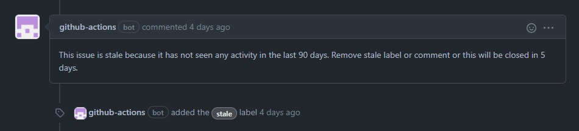
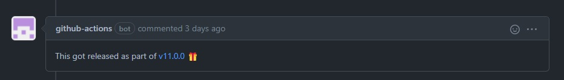

This is going to be a brief introduction to GitHub Actions, followed by a closer look at the two main elements of GitHub Actions: Workflows and Actions.

We will then look at a few examples of how we are using them in one of our client's project, followed by the attempt to inspire you to start thinking about automation yourself.

## Terminology
Let’s start with everyone’s favorite when it comes to new technology: terminology.

Even though it’s called "GitHub Actions", the main thing that you will deal with are going to be "Workflows".

### Workflow
Workflows are what other automation platforms most often refer to as "pipelines". They are the biggest logical chunk in this architecture and they themselves are made up of 1 or more "jobs". Each job is itself made up of 1 or more "steps". These steps can be either arbitrary CLI commands like `yarn install` or they can use an "Action".

### Action
Actions can be either pure JavaScript, ran using NodeJS or they can be Docker-based. They can be used as the steps in your workflows' jobs. You can mix the types of actions however you like in a single job. So you can easily have a job that runs a CLI command (e.g. `npm install`) as a first step, then uses a JavaScript action followed by a Docker action.

### Event
What we also need is a way to trigger workflows. These are called events and there are different types of them:
- "Internal events": These are events that fire when someone pushes to GitHub or adds a comment to a Pull Request or similar
- "Manual events": You can manually trigger events by clicking a button in a workflow that says "Run workflow"
- "Scheduled events": You can also have scheduled events based on a cron job that will for example trigger a workflow once a week, every Tuesday morning or whenever you like.

### Runner
There is one more thing missing to make this whole thing work and that is the actual "Runner" that runs your workflows. The runners are mere applications, running somewhere on a server, listening for your jobs to execute them.
GitHub.com provides a lot of these runners that you can use right away. With a free GitHub account you can use up to 2000 minutes of runner time per month in private projects and there is no limit on public projects, so you can start experimenting with them right away, no strings attached. Have a look at [their pricing model](https://github.com/pricing#compare-features) for further details.

In case you need a very special environment or would like to have more control over the runner you can also host them yourself. With custom runners you can provide specialized environments to run your nostalgic Windows 95 jobs or to have them integrate particularly well with your existing infrastructure.

Runners can have different labels so they can be easily targeted in a workflow. All publicly available runners have labels like `ubuntu-latest` or `windows-latest` to reveal the underlying operating system. There can also be other labels like `x64` or `gpu` to reveal information about the architecture.

## Workflows in detail
With all that terminology out of the way, let's talk about workflows in more detail. Where are they stored, what do they look like from the inside and the outside?

### Location of a GitHub Workflow
Workflows are stored in your repository in a folder called `.github/workflows/` in the form of YAML files. Here you can see a schema of this:
```shell
.github
├── ...
└── workflows
    ├── create-release.yml
    ├── housekeeping.yml
    ├── new-issues.yml
    ├── pr-checks.yml
    ├── release-comment-in-issues.yml
    └── stale.yml
...
```

When you add a `*.yml` file in that folder it will be picked up by GitHub automatically and will be added to the list of workflows in your repository. There is no additional configuration required.

### Anatomy of a Workflow
As already mentioned, Workflows are written in the YAML format. Let's look at a workflow that runs checks on Pull Requests:
```yaml{numberLines: true}
name: Pull Request checks

on:
  pull_request:
    types: [opened, reopened, edited, synchronize]
    branches: [main]

jobs:
  commitlint-pr-title:
    name: Ensure proper PR title 
    runs-on: ubuntu-latest
    steps:
      - uses: actions/checkout@v2

      - uses: actions/setup-node@v2
        with:
          node-version: '16'

      - name: manually install config-conventional commitlint preset
        run: npm install --no-save @commitlint/config-conventional

      - uses: satellytes/commitlint-pr-title@v1
```
First we add a human-readable name to the workflow (ln. 1). In this case this Workflow is called "Pull Request checks".

Next we define a list of events that trigger this workflow with the "on" property (ln. 3). In this case we want this workflow to be triggered whenever there is something happening that is related to a Pull Request so we list the [pull_request event](https://docs.github.com/en/actions/using-workflows/events-that-trigger-workflows#pull_request) (ln. 4). We want to narrow down the types of `pull_request` events that trigger this workflow with a list of `types: [opened, reopened, edited, synchronize]` (ln. 5). We also want to only run this workflow when the target branch of the PR is `main` so we add another filter for that (ln. 6).

With that set up we now define the jobs that make up this workflow (ln. 8). This workflow consists of only a single job that is called `commitlint-pr-title` (ln. 9), or, to make it more human-readable we can give it a "name" property, like "Ensure proper PR title" (ln. 10). This job demands to be run on a runner that is labeled `ubuntu-latest` using the `runs-on` property (ln. 11).

The job is made up of a list of steps (ln. 12). The first step `uses` an action called `actions/checkout` (ln. 13). This action will do a lightweight clone of the repository on the runner. Judging by the name of this action you can infer that it can be found at https://github.com/actions/checkout. All actions that start with `actions/` are part of the "official" actions and are maintained by GitHub. The next step also uses one of the official Actions called `actions/setup-node` (ln. 15) and provides an "input" for this action using the `with` property (ln. 16) to pass the specific `node-version` that we want installed on this runner (ln. 17).

While the previous two steps were using Actions, the next step runs a CLI command to install a dependency using the `run` property instead of `uses` that we've used in the steps before (ln. 20). We will need this dependency in the final step of this job. To improve the readability of the workflow output we explicitly give this step a name (ln. 19). For the steps that don't receive a `name` property, the name in the workflow output will simply be the name of the action or the raw CLI command that was run.

The final step in this job is using another action, called `satellytes/commitlint-pr-title` (ln 22).

You might have noticed that whenever we use an action as a step we also specified some kind of version identifier alongside the name of the action: `actions/checkout@v2`. The name of the action is `actions/checkout` and the `@v2` in this case points to the tag `v2` in the repository of that action. These version identifiers can be any [Git Reference](https://git-scm.com/book/en/v2/Git-Internals-Git-References) that you want. It can be a branch name, a commit hash or a tag. The recommendation is to keep these as precise as possible, so ideally you would avoid having a very imprecise "version" like `@main`.

This workflow will produce an output like this:


### Workflows in a GitHub repository
All the workflows in your repository can be found in a special tab called "Actions":


In this tab you can take a look at any of the past or ongoing workflow runs and their outputs and results.

Workflows that are run as part of a PR will additionally appear in the "Checks" tab in a Pull Request:


## Actions in detail
So now that we've talked about where workflows are located and what they look like, let's go into more detail about the things that make up these workflows: Actions.

### Location of a GitHub Action
Most of the time a single action corresponds to a single repository. The name of an action is simply its GitHub path. It’s made up of an owner and the name of the repository. Throughout the remainder of this section we will take a more detailed look at an action called `satellytes/commitlint-pr-title`. It can be found at https://github.com/satellytes/commitlint-pr-title, note that the path in the URL matches the name of the action. You can also have multiple actions in a single repository, in which case you would add the subfolder to the name of the repository, like `satellytes/actions/my-action`.

To browse available actions you can visit the [GitHub Marketplace](https://github.com/marketplace?type=actions) that has more than ten thousand publicly available Actions that are free for you to use. There are quite a lot of "official" actions like "actions/checkout" but there are far more actions provided by the community. They basically cover everything that you could possibly want to do inside a workflow. That means that most of the time when you want to have a specific workflow, it’s just a matter of putting together the right combination of public Actions in the right order.

> You can very well use actions that are not in the marketplace. Adding them to the marketplace is a voluntary step, but it’s a mere button click away and it makes it easier for others to find your action.

### Anatomy of an Action
Each action needs to provide a file called `action.yml` in its root folder that provides some metadata for the GitHub Actions Runner.

### The `action.yml` file
Let's take a look at the `action.yml` file of the `satellytes/commitlint-pr-title` action:

```yaml{numberLines: true}
name: 'Commitlint PR title'
description: 'This action runs your commitlint config against your Pull Request titles'
author: 'Felix Hamann <felix.hamann@satellytes.com>'
runs:
  using: 'node16'
  main: 'dist/index.js'
inputs:
  commitlintConfigFile:
    description: path to commitlint config file
    default: ./commitlint.config.js
    required: false
  helpUrl:
    description: help url for users of this action
    default: 'https://www.conventionalcommits.org'
    required: false
```

This file contains things like a human-readable name of the action (ln. 1), a description (ln. 2) as well as an author (ln. 3).
This file also explains what is required to run this action. This is done using the `runs` property (ln. 4). In this case this action requires `node 16` (ln. 5) and states a `main` entry file of `dist/index.js` (ln. 6). That means that when this action is used, the Runner will need to provide node 16 to run this particular Action and it will execute the file `dist/index.js` from this action.

As mentioned, there are two main categories of actions. There are JavaScript actions and Docker-based actions. This specific action is a JavaScript action which is executed using the NodeJs runtime. A Docker based Action would specify a value of "docker" as the `using` property here and instead of an entry file it would point to a Dockerfile. [Here](https://docs.github.com/en/actions/creating-actions/creating-a-docker-container-action) you can find more information about docker-based actions.

Other things that this file also states are inputs that this action might accept (ln. 7) or outputs that it provides (does not apply for this action). In this case we have two inputs: `commitlintConfigFile` (ln. 8) and `helpUrl` (ln. 12). For each input we can specify a description (ln. 9), a default value (ln. 10) and whether or not this input is required (ln. 11).

### The `main` entry file
This is where we can finally talk about some actual code. In the case of the `satellytes/commitlint-pr-title` action the entry file `dist/index.js` is compiled and minified from TypeScript sources so it wouldn't be a lot of fun to look at. So instead of looking at that `main` file directly, let's take a look at [the actual TypeScript source](https://github.com/satellytes/commitlint-pr-title/blob/main/src/main.ts):

```ts{numberLines: true}
import core from '@actions/core';
import github from '@actions/github';
import { lint, formatResult } from './lint';

(async function run() {
    const title = github.context.payload.pull_request?.title;
    const configFile = core.getInput('commitlintConfigFile');

    core.info(
      `🔎 Checking if the title of this PR "${title}" meets the requirements ...`
    );

    try {
        const lintResult = await lint(title, configFile);
        if (!lintResult.valid) {
            core.setFailed(`\n ${formatResult(lintResult)}`);
        } else {
            core.info('✔️ All good');
        }
    } catch (error) {
        core.setFailed(error as Error);
    }
})();
```

We won't go into a lot of detail about what this code does. I'll leave this as homework for you to explore.

The main takeaway should be, that there are two important libraries that we are using: `@actions/core` and `@actions/github` (ln. 1 & 2). These two libraries provide a lot of utilities to interact with the process that is running on the GitHub runner. They allow you to fetch information about the event that triggered this workflow as well as make it easy to report the result of your action. You can get up close and personal with this code and explore the inner workings in [the action's repository](https://github.com/satellytes/commitlint-pr-title).

### Compiling and bundling an Action
As we've seen in the previous subsection we can have pretty much any code we want, as long as we provide a main entry point for the GitHub runner to execute. In this particular case we not only have to bundle everything into a single file but we also need to take care of compiling the TypeScript sources. There are probably thousands of ways to turn TypeScript into JavaScript and even more ways of producing a single bundle file. After a lot of experimenting with `rollup`, `webpack`, and other tools, I settled with [`@vercel/ncc`](https://github.com/vercel/ncc) to transpile, compile and bundle this action. `ncc` is a CLI tool that I found surprisingly comfortable to use. It works nicely for regular vanilla JS projects but it also supports TypeScript out of the box and is meant to ship a single file that contains everything that is needed, from your actual source code to everything from inside the depths of your `node_modules` folder that is required to run your action.

The TypeScript file shown above is called `src/main.ts`. The bundling is done by calling `ncc build src/main.ts`. This will produce a file `dist/index.js` that we then point to in the `action.yml` file, as shown above.

Pitfall: You need to remember to run your build/bundle step whenever you change your source code and commit the new generated artifact alongside your changes. This is important for the compiled code in your repository to not get outdated. I've spent more time than I'm comfortable to admit, trying to figure out why a certain change didn't affect my action until I realized that I didn't recompile the code before committing.

> 💡 Having a `pre-commit` hook that runs your build/bundle step is a great way to automate this.

> 💡 Of course, there is no need for you to write your action with TypeScript - that's just what I feel most comfortable with.

## Inspiration: example workflows
Now that you know what workflows and actions look up close, let's take a look at some of the workflows that we are using in one of our client's project to make our daily lives more comfortable. We are after all developers and we are known to be lazy, aren't we?

### Workflow: Pull Request checks
The workflow and the action that we've talked about so far in this blog post are of course one of these examples.

#### What problem does it solve?
In a lot of our projects we are using the `squash` method to merge Pull Requests. That means that the title of a Pull Request will end up being the commit message of a commit in our `main` branch. For local development we've set up a tool called `commitlint` to make sure our developers adhere to the rules for commit messages that we agreed on. This is enforced using a git hook, which checks each commit and ensures that the developer provides a valid commit message. However, when creating a Pull Request in GitHub there is no straightforward way to enforce these same rules.

#### How does it solve the problem?
The configuration for `commitlint` is stored alongside our code, in the same repository. The `commitlint-pr-title` action is used to lint the titles of Pull Request and most importantly it is using the same configuration that we use locally to lint commit messages. This means these configurations will never get out of sync and we only need to maintain them in a single place. In GitHub we've set up ["branch protection rules"](https://docs.github.com/en/repositories/configuring-branches-and-merges-in-your-repository/defining-the-mergeability-of-pull-requests/managing-a-branch-protection-rule) that requires the workflow to pass successfully before a Pull Request is allowed to be merged. This way we ensure that any squashed commit that arrives in `main` will follow the same guidelines that we use during out local development.



### Workflow: New issues
This workflow is run for all new issues that are being opened in our repository.

#### What problem does it solve?
We are using a "Project" in GitHub, which is like a Kanban board to organize issues. We only have a single project that we use to organize all our issues. To make this work, we need to add any new issue to this project so that it appears on the project board. During our meetings we mostly look at this project board to triage new issues. Because we forgot to add some of the new issues from time to time, we forgot to talk about them during our refinements and so we never addressed some of them.

#### How does it solve the problem?
This workflow consists entirely of already available actions so it was pretty much a plug & play experience. All it does is, whenever there is a new issue, it adds it to our project. In every meeting in which we look at our project board we can now be sure that all new issues are listed in our backlog. This is especially relieving for issues that got created by some external party that is not aware of our GitHub project.



### Workflow: Create release
We are also making use of Releases in GitHub. These are meant to keep a neat history of released versions of our libraries. This is particularly nice because GitHub users can "subscribe" to our repository and choose to be notified if there is a new release.

#### What problem does it solve?
Creating releases, so far, has been a manual process. So every time our Jenkins release pipeline ran (yes, we also use Jenkins), it pushed a new release commit with the updated `CHANGELOG.md` file and a new tag to our repository but we then had to manually extract the changelog from the commit and manually create a GitHub release. We forgot to do this from time to time so our subscribers did not get notified and missed out on important updates.

#### How does it solve the problem?
The workflow that we are using to do this is a mixture of publicly available actions and a shell script to extract the change in the `CHANGELOG.md` file. It get's triggered whenever the repository receives a new `tag` and it automatically creates the release in GitHub. This is just one more thing off our minds, one less thing to worry about when the release panic hits.



### Workflow: Stale issues
As part of the issue management we need to keep track of old issues.

#### What problem does it solve?
As our repository grows and evolves so does the number of issues that accumulate. Over time some of these issues become obsolete.

#### How does it solve the problem?
Using a scheduled GitHub Workflow that runs once every night we mark "old" issues (90 days without interaction) as stale. This workflow uses the official `actions/stale` action. If a stale issue is not being interacted with within 5 days it will get closed automatically. If an issue gets marked as stale and the team agrees that it's still relevant during the next refinement meeting, we remove the `stale` label.



### Workflow: Release comments
We use keywords in Pull Requests like `closes`, `fixes`, or `resolves` to automatically close issues that are done from a development point of view.

#### What problem does it solve?
With issues being closed when a corresponding Pull Request got closed it's sometimes hard to keep track of the release that a certain fix or feature got published with.

#### How does it solve the problem?
This GitHub Workflow leaves a comment on released issues that informs any subscriber about the specific release that shipped the changes necessary to close the issue. This is done using a custom bash script that reads the CHANGELOG and extracts all issues that got published as part of the latest release. This list of released issues is then being passed to a custom action that uses GitHub GraphQL API to leave comments on these issues.



### Workflow: Housekeeping
Housekeeping is an important aspect of the fast-paced frontend world. We used to have an issue to remind us to update our dependencies every once in a while. As with a lot of manual processes we forgot to do this from time to time. Especially when it comes to important vulnerability fixes it’s important to keep up to date. We now have a workflow to take care of that once a week using a scheduled event. With integrated tools like "Dependabot" this workflow might be obsolete soon, but so far we enjoy the fact that we are in full control of the workflow and can tweak and configure it to our hearts content.

## Conclusion

In this blog post you learned the most important things about the terminology that you need to get started as well as got a first technical glimpse at what it means to author workflows and actions. If you've made it this far, I really recommend you give it a go. I can't stop myself from smiling whenever I see something that was done by `github-actions [bot]` and I really hope I was able to get you interested in GitHub Actions and automation in general.

Let's end with some slightly philosophical thoughts about automation.

### Driven by laziness
Most of the examples that I've shown are driven by laziness or the very fact that humans simply forget to do things from time to time. It's the laziness to not assign a certain project to a new issue or the laziness to not run `yarn upgrade` once in a while. Basically the point of this blog post was to inspire you with the inherent laziness that I discovered in myself over the past few years.

### It's not about the code
All these examples have one more thing in common: They are not necessarily related to the code in the repository. They rather deal with processes and metadata. They automate the things that we have to deal with on a daily basis that have to do with issue management, release cycles, vulnerabilities in third-party dependencies and so on.

Other external automation platforms like Jenkins, TravisCI or CircleCI are certainly splendid tools when it comes to automation, but from my experience, nothing integrates as smoothly into GitHub as "GitHub Actions" do. This is not particularly surprising, given the name - but it's still worth mentioning.

While external automation platforms sure provide a lot of value - and will continue to do so - there are aspects of a repository that are easiest automated using GitHub Actions (given that that repository already lives inside GitHub).
The convenience with which you can interact with Projects, Issues, Releases and other non-code related features of GitHub have been a crucial deciding factor for me, when choosing _where_ to automate things. I won't advocate migrating all your pipelines to GitHub Actions. Instead I suggest to start small. Start with the things that would be hard to automate with your existing automation infrastructure and then slowly migrate whatever feels right.

> "A repository is more than the sum of its code. Automate the repository, not the code."

There is a lot more to automation then the typical "continuous integration" and "continuous delivery" pipelines. Think outside of the box of CI/CD and be creative.

### What's next?
There is no good excuse to not get started right away. If you are interested in writing an action, take a closer look at the `satellytes/commitlint-pr-title` action, available in [this repository](https://github.com/satellytes/commitlint-pr-title). If you are interested in creating your first workflow, take a look at the [GitHub Marketplace](https://github.com/marketplace?type=actions) for even more inspiration. In case you want to immediately jump into the official documentation and continue learning about the technology itself: You can do so [here](https://docs.github.com/en/actions).
