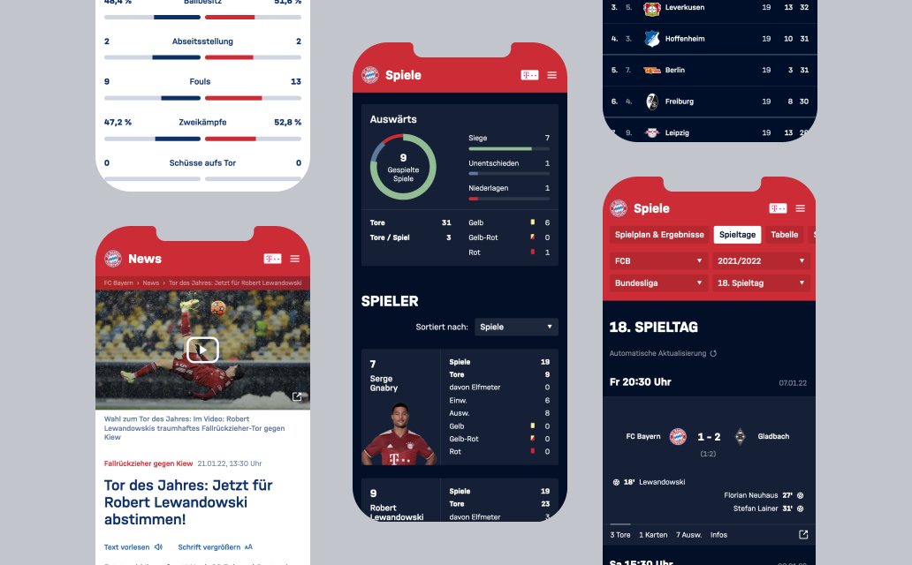
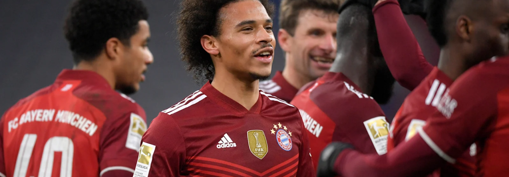
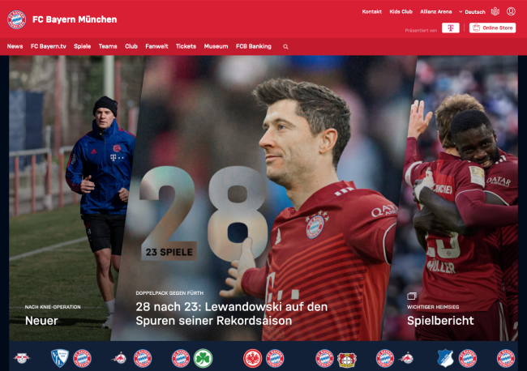

<sectionheader>
 Our task was the frontend relaunch of the FC Bayern website. We took a holistic approach and created a design system with a solid set of components and guidelines to unify the look and feel of forthcoming digital experiences and introduced a headless architecture as a modern foundation on top of the existing CMS to be prepared for everything to come.
</sectionheader>

#### [www.fcbayern.com](www.fcbayern.com)

  

<stat title="Team Size" content="6 people"></stat>
<stat title="Start" content="December 2018"></stat>
<stat title="End" content="Ongoing"></stat>

### Approach

We started with an inventory of all applications and platforms in the FC Bayern München ecosystem and a thorough benchmarking of other sports clubs with the goal to create the best soccer club page out there and also a solid fundament to build and expand on after the initial launch with many more exciting features to come.
We analyzed all features and funnels on the then current FC Bayern München website, extended the style guide with new patterns and guidelines that can serve all use cases and created a design system as a single source of truth – also for other agencies and future products.
We created a new architecture for the website that can serve all common and special use cases of an international soccer club like FC Bayern, e.g. live-features, special announcements, a comprehensive match center with detailed stats that satisfy even the biggest fans and formats that enable FC Bayern to interact with their diverse audience.
We created a powerful theming system with light/dark support that makes it easy to adapt the implementation to changing designs required by the different teams and companies within the FC Bayern universe.

 

### Our Responsibilities

We enforced coding and quality standards through automation to ensure the integrity of the website platform in terms of design, functionality & accessibility.
We coordinated and aligned our efforts with the existing backend service provider to shape the headless API. We integrated existing libraries and components from inside and outside the FCB domain (like the FCB shop) to give users access to business critical content outside the scope of the relaunch project. We also worked together with other departments and teams inside FC Bayern to align all streams and their technical approaches.
Active contributions, requirements engineering and technical guidance in the context of a well-running Scrum progress were also an important part of our work to enable productivity in an interdisciplinary team with experts from FCB and the API development team.

 

### Our Technical Contributions

We introduced a static site generation (SSG) approach based on Gatsby to reduce the hosting efforts while keeping React our main framework. On top of a statically built website, we added dynamic components to allow instant articles, live tickers and live score updates on game days. WIth real-time updates during live matches, we are able to bring the user the latest action as it happens.

We created a React UI library that allowed us to develop and test UI components, variants and states independently from the rest of the website. This library, although only intended to increase the development process, is now in consideration to be distributed well beyond our initial project scope.

With over 2000 unit tests, we added trust and reliability that allowed us to incorporate changes as new business requirements came up.

With static sites generated from Gatsby, we were able to achieve greater loading times and improve the SEO performance by pre-generating the entire content of more than 500.000 HTML pages with optimized images, CSS, and JavaScript files.

Accessibility was considered a first-class citizen and we put in a lot of effort to make most of the components of the future FC Bayern website usable and enjoyable for everyone.

We support a preview-mode for editors that allows them to preview their draft changes before they are published to the website.

We support incremental content updates to limit rebuilds to only those parts of the page that need updating. By doing so, we are able to decrease build times to a fraction of the time normally required for a complete rebuild.

We integrated a variety of external libraries and services like Cloudinary for image optimization, Usercentrics for privacy compliance, Kaltura video and audio services, Google Analytics and plugins from the FCB Shop to ensure our customer’s business, legal and usability requirements were met.

The website was developed with a mobile first mindset and is fully responsive across three different viewport sizes, including optimized, responsive images for each breakpoint.

