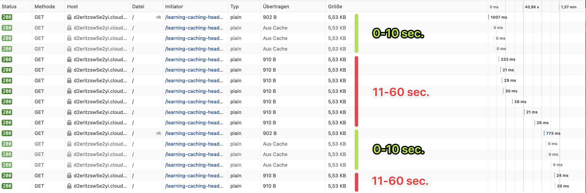
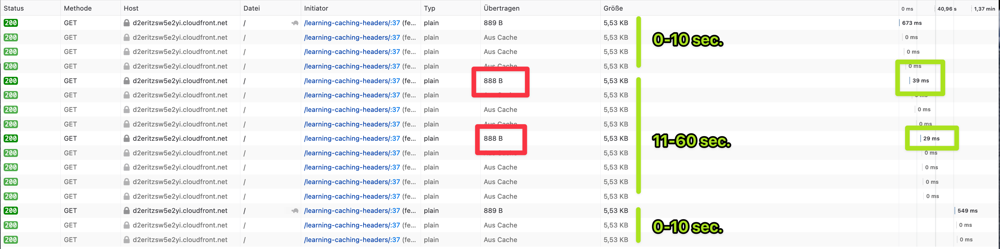
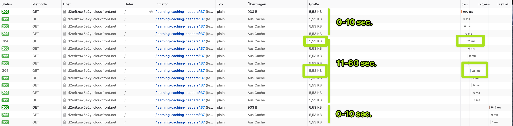

Lately we were trying out CloudFront to improve our API response and caching times. We wanted to cache the response
in the browser for 10 seconds, and on CloudFront for 60 seconds. What sounds like a simple requirement turned out to be
more complicated than we thought. What is often said and often right: The devil is in the details.

## The problem

We want our origin server to control the caching behavior of CloudFront. As with any other CDN, this can be done with
the [`Cache-Control`](https://developer.mozilla.org/en-US/docs/Web/HTTP/Headers/Cache-Control) header. So we configured 
our origin to return `Cache-Control: max-age=10, s-maxage=60` with every response.

This `Cache-Control` header has 2 directives: `max-age` and `s-maxage`. `max-age` tells the client for how long the 
response should be cached in seconds. `s-maxage` does the same, but for the CDN in between our origin and the client.
So we can define a different caching time for the CDN and for the client. This is cool, as we can now cache our response on 
the CDN for a longer time (and update it when we need to or after the defined time), but still cache it on the clients for 
a shorter time and make sure they are always up-to-date.

In our case the browser should cache the resource for 10 seconds, and the CloudFront for 60 seconds. To test this header
, we created a small sample application within AWS Lambda and CloudFront as CDN. The Lambda returns the given caching 
header and a small JSON body. Let’s check within the browsers network console what happens when we do multiple requests 
within 70 seconds:



What do we see here?

1. The first request hit’s the Lambda function. This is takes around 1 second, as the function is cold and uncached by
   CloudFront. The response gets now cached by the browser and CloudFront.
2. The next 3 requests are not send by the browser, as they are within 10 seconds, which is the `max-age`. The browser 
   just returns the cache. The request time is therefore 0 seconds.
3. The next 7 requests are all done the next 50 seconds. They hit the CloudFront cache, the response time is therefore
   around 20ms.
4. 60 seconds after the first requests, CloudFront clears the cache. The request hits the lambda
   function, so it takes around 700ms. After that requests, the same procedure starts again.

What is wrong here?

1. The browser should cache every request for 10 seconds. But it only caches the first requests for the `max-age` and
doesn't cache anything for the rest of the remaining `s-maxage` time.
2. After 10 seconds the browser requests the same resource again. As there was no change in the response body, 
CloudFront should only return `304`. Instead, the whole body gets returned with a status `200`.

Those 2 problems will result in

- Additional **traffic you have to pay** between the browser and your CDN.
- A **slower website**, as the browser has to wait for the request to complete. This problem increases if your response
body gets larger or the network speed of your customer decreases (a.e. on mobile plans).
- Additional **traffic your customer has to pay** if the data is not free (a.e. on mobile plans).

## Fixing the browsers cache behavior

We spend hours and hours figuring out why the browser only caches the response for the `max-age` time, and then ignores 
the cache for the rest of the `s-maxage` time. As it turns out, we were not the first ones who stumbled upon this problem:

- [Browser cachability issues with CloudFront (CDN Planet)](https://www.cdnplanet.com/blog/cloudfront-cachability-date-header/)
- [CloudFront Date header cached indefinitely (AWS Forum)](https://forums.aws.amazon.com/thread.jspa?messageID=807813)
- [CloudFront "age" header effect on "cache-control: private; max-age=3600" (Stackoverflow)](https://stackoverflow.com/a/61493383/3141881)

The root of the problem is the `date` header returned by CloudFront. It doesn’t change on upcoming
requests. As caching times in the `Cache-Control` header are relative to the response `date` header, only the first 
request by the browser get's cached for the `max-age` time. 

> CDNs usually don't cache the `date` header, it's only CloudFront that does it.

There is no easy way to fix this within some CloudFront settings. Only recently it is possible to solve this problem at
all: With a custom CloudFront Function. CloudFront Functions are small Javascript functions that are executed with every
request. You can use them to do simple changes to the request or response object. Read more about the possibilities and
limit in the official AWS docs
here: [https://docs.aws.amazon.com/AmazonCloudFront/latest/DeveloperGuide/functions-javascript-runtime-features.html](https://docs.aws.amazon.com/AmazonCloudFront/latest/DeveloperGuide/functions-javascript-runtime-features.html)

We can use those functions to update the `date` header with every request.

```js
function handler(event) {
  var response = event.response;

  response.headers['date'] = {
    value: new Date().toUTCString()
  };
  delete response.headers['age'];

  return response;
}
```

This code updates the `date` header with the current time. It also deletes the `age` header, as it turns out that
CloudFront is also setting it. The [age header](https://developer.mozilla.org/en-US/docs/Web/HTTP/Headers/Age) is used
to tell how long the cached object is in the cache. If it is set, the browser will compare it against the `max-age` time
and decide to not cache the object. Which is not what we want.

After deploying the CloudFront function, let’s check the browser console:



What do we see here:

1. The first request hits Lambda, so it takes around 700ms.
2. The requests within 10 seconds are cached. After that, one request is done to CloudFront. This request takes around 30ms
   and is cached again for 10 seconds by the browser. CloudFront returns the full response.
3. Only after 1 minute, the requests hits Lambda again and gets then cached again by CloudFront.

This is the behavior we want! Nice!

> CloudFront Functions are $0.10 for 1 million executions, so they are quite cheap. More about the pricing on the
> official page: https://aws.amazon.com/cloudfront/pricing/#Feature_Pricing

Next, let’s see how we can return `304` if we hit CloudFront and the response hasn't changed since the last request.

## Return 304 if the object hasn't changed in CloudFront

CloudFront always returns `200` with the full response body. This results in a lot of unnecessary data send between the
browser and CloudFront. To fix this, we need to set the `ETag` header in our Lambda function.

The `ETag` is a hash for the response body. The browser will send this hash with alongside with all upcoming requests to
the same resource. The server can then decide if the resource has changed and either return `200` with a new resource
or `304` .

Luckily, when the `ETag` header is set, CloudFront will handle `200` and `304` automatically. We don't have to configure
anything. The `ETag` needs to be created in our Lambda function. This is how the generation could look like:

```js
const createEtag = (body: string) => {
  const hash = createHash('md5').update(body).digest('hex');
  return `W/"${hash}"`
}
```

Depending on your usage, you may want to use different hashing algorithms that are more performant.

Now let’s check again our browser console:



Now it’s perfect!

1. The first request hits Lambda. The response gets cached by the browser for 10 seconds and 60 seconds by CloudFront.
2. The next 3 requests are within 10 seconds, so they are not send over the network.
3. After 10 seconds, the request get’s send to CloudFront. CloudFront return `304` with an empty response body.
4. After 60 seconds the requests hits Lambda again.

## Conclusion

CloudFront is a very good CDN, but you need to know what to do. As CDNs are the most relevant when there is high traffic,
mistakes can increase your bill a lot or even lead to downtimes of your api/website/product. That's why it's important 
to have a close look to the details. It gives you the confidence to scale.

If you want to add CloudFront to your API make sure that:
- when you have a different `s-maxage` and `maxage` you need to overwrite the `Date` and `Age` header in CloudFront.
- when you want to return `304` if the response hasn't changed since the last request, you need to set the `ETag` header in your origin.

I hope you learned something with this blog post. Thanks for reading :)

Check out the full project - including the CloudFormation template - on Github: [https://github.com/satellytes/learning-caching-headers](https://github.com/satellytes/learning-caching-headers)