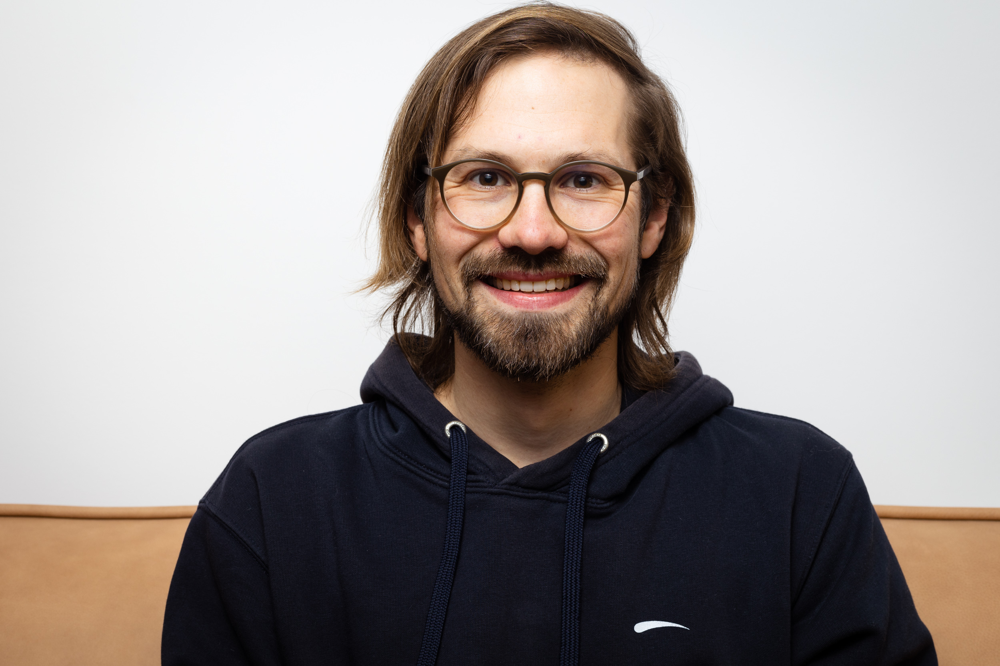
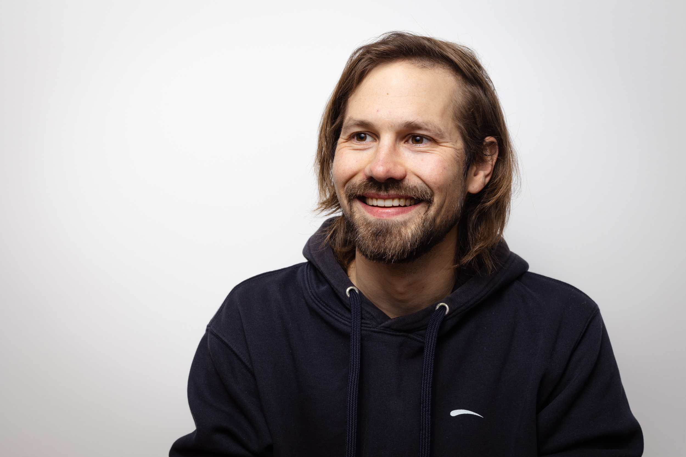

## Interview mit Felix Hamann
Felix Hamann ist unser Mitarbeiter #1 und damit seit fast vier Jahren Teil von Satellytes. Wir haben ihn zum Interview eingeladen, um zu erfahren was er erlebt hat und wie er sich weiterentwickeln will.

 **Hallo Felix. Schön, dass Du Dir die Zeit nimmst. Stell Dich doch mal kurz vor.** 
Hi! Ich bin Felix. Ich habe noch das Piepsgeräusch der 56k Modems im Ohr, bin also schon eine ganze Weile dabei. Seitdem ich denken kann faszinieren mich Computer und Webentwicklung.

 **Du bist der erste Angestellte bei Satellytes. Bist Du nach all den Jahren immer noch happy? Highlights? Lowlights?** 
Immer noch happy. Mit Ausrufezeichen! Highlights: Immer wieder ins kalte Wasser gestoßen zu werden, weil „Life begins at the end of your comfort zone". Beispiele für „kaltes Wasser": Vor kurzem habe ich zum ersten Mal eine Präsentation auf einer Entwickler-Konferenz „eMerge" gehalten und in einem meiner letzten Projekte hatte ich eine Managementrolle inne. Lowlights: Mir fällt eigentlich nur Corona ein, aber ich als introvertiertes Kellerkind bin zu Hause sowieso immer happy... trotzdem finde ich es schade, dass es letztes Weihnachten wieder keine solche legendäre Weihnachtsfeier wie 2019 auf der Hütte geben konnte.

 **Du hast den eMerge Talk als Highlight genannt. Wie kam’s dazu?** 
Wir benutzen Lattice als Career Development Tool bei Satellytes und dieser eMerge Talk war eines meiner „Goals". Ich habe mit meinem Manager zusammen beschlossen, dass es eine gute Idee ist das mal auszuprobieren und mich mehr auf die Bühne zu wagen. Das Thema war „Automation mit Github Actions", weil ich in meinem aktuellen Projekt sehr viel damit gemacht habe.

 **Und wie war’s?** 
Ich habe zuvor mit meinen Kollegen einige Dryruns gemacht, mit deren Feedbacks ich die Präsentation rund geschliffen habe und am Ende habe ich mich richtig gut damit gefühlt. Beim Talk selbst hatte ich anfangs bestimmt ein Tremolo in meiner Stimme, aber schnell gemerkt, dass ich richtig tief im Thema drinstecke und das daher auch gut erzählen kann. Ich war bei den Proben mit meinen Kollegen aufgeregter als beim Talk selbst. Ich habe sogar die QA-Fragen gut beantworten können vor denen ich ein bisschen Bammel hatte – ich war einfach so gut vorbereitet wie schon lange nicht mehr und das war super!

 **Mehr davon?** 
Auf jeden Fall.

 **Warum mehr?** 
Neben mir waren Sprecher von Google, Spotify und Microsoft auf der „Bühne", da war ich schon ein bisschen stolz ein Teil davon zu sein. In erster Linie geht es mir aber darum, Wissen weiterzugeben. Kurze kompakte Präsentationen auf Meetups und Konferenzen sind meiner Meinung nach ein idealer Einstieg in diverse Themen. Von allen Entwicklerkonferenzen auf denen ich bisher war bin ich mit einer Liste von Technologien und neuen Methoden nach Hause gekommen, die ich unbedingt ausprobieren wollte. Die Vorstellung, dass meine Präsentation diesen Wunsch in anderen Entwicklern auslöst, fühlt sich klasse an.

> Programmieren ist im Wesentlichen, wie ich finde, ein äußerst kreativer Prozess.

 **Wolltest Du schon immer Developer werden? Wenn Du nicht Entwickler geworden wärst, wärst Du heute ...** 
Bäcker, Schreiner, Skater, Bauer, die Bandbreite ist groß. Ich liebe kreative Handarbeit und ich genieße es Dinge zu erschaffen. Programmieren ist im Wesentlichen, wie ich finde, ein äußerst kreativer Prozess. Für jedes Problem gibt es meist eine Vielzahl an Lösungen und man muss kreativ und innovativ denken um die Beste zu finden. In den meisten Fällen gibt es außerdem nicht „die eine, beste Lösung", das sorgt dafür, dass jede neue Herausforderung spannend bleibt. Es wird nie langweilig.

 **Wie haben sich deine Aufgaben in den letzten Jahren bei Satellytes geändert?** 
Ich war zuvor selbständig und habe mich nie an so große Projekte getraut wie ich sie hier bei Satellytes bekomme. Mir wurde von Anfang an sehr viel Vertrauen geschenkt und mir ist dadurch erst bewusst geworden was ich überhaupt kann – das ist wieder das Thema „ins kalte Wasser gestoßen zu werden" und „einfach machen". Dadurch habe ich viel an Selbstsicherheit gewonnen. Die Aufgaben haben sich gar nicht groß geändert, aber ich gehe heute mit mehr Zuversicht an sehr große Aufgaben heran, weil ich mittlerweile aus Erfahrung sagen kann, dass man sie in kleinen Schritten immer bewältigt bekommt.

 **Wohin geht die Reise? Evangelist? Manager?** 
Ich will auf jeden Fall noch sehr lange programmieren. Leute oder Projekte managen will ich gerade noch nicht – diese abstrakte Managementebene turned mich nicht an. Ich will lieber knietief in Code stecken. Und das Wissen, das ich sammle will ich an andere Entwickler weitergeben. Ich will auch mehr Artikel schreiben, Präsentationen halten – das ganze Thema „Wissenstransfer" finde ich sehr spannend.

 **Thema „Wissen an andere Entwickler weitergeben". Tipps für Einsteiger?** 
Einfache Antwort: YouTube und Google. Längere Antwort: Ich habe festgestellt, dass es unterschiedliche Lerner-Typen gibt. Ich selbst installiere einfach eine neue Sprache und fange an zu tippen und dann passiert von alleine irgendwas etwas. Ich programmiere dann einfach einen Taschenrechner oder eine Todo-Liste, irgendwas. Aber nicht alle haben diese Kreativität, oder wissen nicht wie sie geweckt werden kann. Viele Leute brauchen konkret vorgegebene, erreichbare Ziele auf die sie hinarbeiten können. Gerade wenn es darum geht eine neue Sprache/Technologie zu erlernen. Es gibt sehr viele Listen mit großartigen Projekten, die man ausprobieren kann um ein Gefühl zu bekommen. Einfach nach „Beginner Projekte für Einstieg in ..." googeln. Da findet man 1000 Projekte, die man machen kann.

> Ich vergesse zu essen, trinken, ich bin immer total im Tunnel.

 **Klingt so als wärst Du immer lernhungrig und bräuchtest nie eine Pause ...** 
Wenn ich nicht von Jemandem abgelenkt werde (Freundin ❤️), vergesse ich alles um mich herum. Ich vergesse zu essen, trinken, ich bin immer total im Tunnel. Ich überhöre sogar den Pomodoro-Timer, den mir ein Kollege mal dafür empfohlen hat. 

 **Aber Wochenenden bekommst Du schon mit, oder? Was machst Du dann?** 
Wenn’s das Wetter erlaubt gehe ich Gleitschirm fliegen, „Paragliden". Generell verbringe ich viel Zeit in der Natur, beim Pilze sammeln oder Bergsteigen. Ansonsten programmieren. Zur Zeit beispielsweise machen viele meiner Kollegen und ich bei „Advent of Code" mit. Das ist ein Adventskalender für Nerds mit täglich zwei spannenden Programmier-Herausforderungen. Challenges, die ich unter der Woche nicht geschafft habe, hole ich dann am Wochenende nach. Und (natürlich) viel Quality Time mit meiner Freundin.

 **Wie bist Du auf’s Paragliding gekommen? Gibt es Gemeinsamkeiten oder Gegensätze zu deiner Arbeit?** 
Durch meinen Bruder. Beim Paragliden kann man sich nur mit viel Erfahrung ein konkretes Ziel setzen, aber meistens fliegt man einfach drauf los und schaut wie Wind und Wetter mitmachen. Man kann schon sagen: „Ich versuche zu diesem und jenem Gebirgskamm zu fliegen.", aber es ist nicht planbar, nicht systematisch. Man ist der Umwelt ausgeliefert, einer plötzlichen Wolke vor der Sonne, einer anderen Windrichtung wenn man ein bisschen höher oder tiefer fliegt. Man ist im Hier und Jetzt und gibt die Kontrolle ab – ein willkommener Unterschied zum Entwickeln, wo man doch im Großen und Ganzen „Herr der Lage" ist.

 **Schön beschrieben, danke dafür. Apropos Hier und Jetzt. Was steht heute noch an?** 
Wir sind heute mit einer neuen Version von Satellytes.com live gegangen und haben da noch ein bisschen was zu tun. Außerdem geht einer meiner Kollegen bald für drei Wochen in den Urlaub, deswegen müssen noch zwei Pull Requests von ihm gereviewed und gemerged werden solange er noch da ist – und unbedingt abspülen. Mein Zuhause sieht aktuell aus wie S...

 **Zuhause ist ...** 
... wo sich mein Handy automatisch mit dem WLAN verbindet. Klingt bisschen klischeehaft, aber der Spruch bewahrheitet sich immer wieder. Ich nehme mir nur dort die Zeit mich mit dem Internet zu verbinden, wo ich es mag und vielleicht nochmal herkommen möchte.

 **Letzte Worte?** 
Ich freue mich auf die nächsten `3.75 * x` Jahre bei Satellytes 🙌
