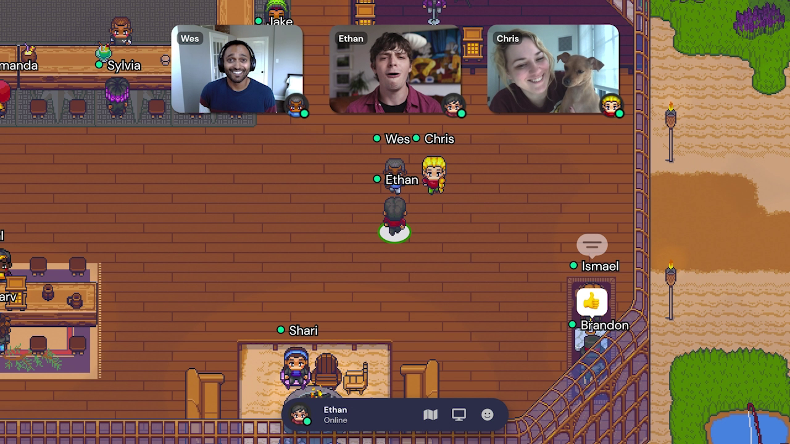
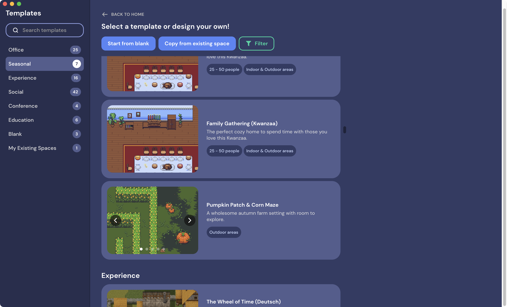
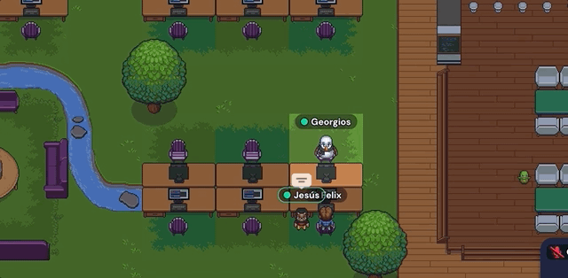
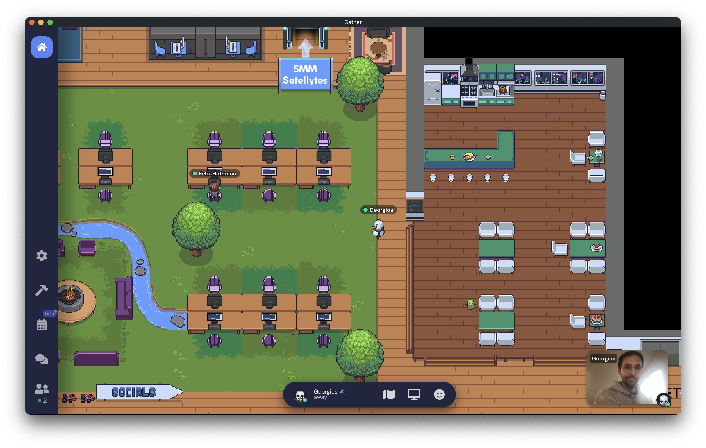

## Introduction
A few weeks ago, we introduced [Gather](https://www.gather.town/) at Satellytes to make our daily remote life more pleasant and to fight [Zoom Fatigue](https://en.wikipedia.org/wiki/Zoom_fatigue). Gather describes itself as a **_"platform that combines a 2D game-like interface with video-chat"_**. 

At first glance it might look like a game, but that's only the visual presentation chosen by gather (although you can run go-karts and play integrated games like Tetris). The core use-cases are actually all focused around office life and human interactions.

Only people you invite can access your world. You pick an avatar and walk around a virtual office. Once you bump into a colleague, a small video window opens near your avatar, and you can start talking. When you walk away from a conversation, the video and voices diminish until the chat closes. When you focus a different window, while not being in a conversation, your video and audio are always muted, but people can still try to approach.

First, we invited a few colleagues just to try out the mechanics together but pretty soon we saw the magic of the [Metaverse](https://www.gather.town/post/why-the-metaverse-matters) happening.

_Official gather screenshot with people hanging around_

## Metaverse
Phillip Wang, the CEO of Gather, has published a little article to the question ["What exactly is the Metaverse?"](https://www.gather.town/post/why-the-metaverse-matters) so I think it's best to cite him:

> Traditionally, physical location has dictated how we live. Most of us have been forced to live near where we work, which means we rarely see friends and family who live elsewhere. For many of those without the means to move, location is a barrier to opportunity altogether.
> 
> The Metaverse solves this problem: it's the next iteration of the Internet that brings a sense of place and facilitates rich human connection. In a virtual office you can work alongside your teammates, and strike up casual conversations throughout the day. Together with your friends, you can watch movies in a virtual cinema, enjoy art in a museum, or hang out in a park. You can even go to class with a teacher from halfway across the world, and take a field trip to the pyramids.

This sounds a lot like [Second Life](https://en.wikipedia.org/wiki/Second_Life). Probably the earliest, rather forgotten, type of Metaverse out there. The thing that makes Gather much different is the 2D appearance and the limited interactions. It's not trying to mimic the real world at all. That keeps the focus on the human interactions, which suffered so much during the COVID-19 pandemic when people were forced to move into the home office.

## How we use Gather
We started using Gather exactly six weeks ago. Your first task is to create your own space. Luckily, they offer plenty of pre-made spaces to pick from. I created a virtual office space, where we could sit at desks or meet at the bar in a kitchen.

_Pick an existing gather space from plenty of templates_

From the beginning, I forced myself to keep Gather running every day to act as a role model. Occasionally, I would invite someone from the team to try out Gather with me. 

### All-hands meetings
Once we reached a "critical mass" of people using Gather, I decided to switch our all-hands meeting on Mondays from Zoom to Gather. We would run our meeting on a small, sunny island. That was also the first time I had to use the [mapmaker](https://support.gather.town/help/mapmaker). Because everything is possible in the Metaverse I decided to build a suburban station to connect the island with our office.

_Our Satellytes folks gathering for our all-hands meeting on a Monday_

The actual meeting is held in a specially prepared meeting room (here the island). Everyone who enters a room can talk to each other and see all people's videos. We start talking and provide the latest company news and people can ask questions and share their thoughts. When the meeting is over people leave the room and start bumping into each other, create random groups, and tell their stories from the weekend — just like in the real world. Compare this with the Zoom dystopia, where everyone usually joins into a single video chat and leave directly after the meeting back into isolation (I exaggerated a little).

The meeting room behavior of Gather is fundamentally different to the rest of the virtual world, where people can only talk to each other when they are close by. That's called "spatial audio technology", more on that in the following example.

### Random bumps
When you walk to someone, while approaching, the video and audio slowly fade in. That technique is called "spatial audio technology" and mimics the way we bump into other people in real life, where someone's voice is louder while you are near them, and softer as you walk away. This is wonderful because it feels so familiar and natural.

<video preload autoplay loop width="100%">
  <source src="images/gather/video.mp4" type="video/mp4" />
  <source src="images/gather/video.mp4" type="video/mp4" />
</video>

_People bumping into each other (via [gather.town](http://www.gather.town))_

### Pair programming
A similar effect happens when you sit in the virtual office and suddenly two folks group up on the other side of the table. Instantly you know, _"oh, they do some pair programming"_. When I asked my colleagues about their session, they said it's a nice way to meet at some actual (although virtual) location and then just _"bump into the other person"_ to start the session. 

This feeling is the promise of the Metaverse. It brings back the informal human interactions and spontaneity. You don't have to create a video meeting upfront or send some specific invitation. Who would do that in real life? Instead, you just walk over to the desk of your colleague and start talking.  

_Our colleagues Jesús & Felix having a pair programming session_

### Hanging around
While we can gather everyone for some all-hands easily, we have the biggest struggle to motivate people to stay online throughout the day. A few colleagues and I are online most of the day. The other ones are online occasionally or just for the invited events. Sadly, this means our world looks very empty, very often.

_Our Satellytes space often looks that empty_

What can we do about that? When I ask people, I get various feedback:

+ I fear I can't work focused enough because people will disturb me all the time
+ I don't trust Gather that the microphone and video is truly switched off every time I focus on another window
+ I'm intimidated with Gather as I don't play games often
+ I just forget to start Gather on the morning
+ It doesn't integrate in any way with my work routing / other tools
+ It requires me to spend too much focus on the app itself (the effect 'bumping' into someone is rather an active one)

I think this list describes people's issues with their comfort zone. Especially with a tool like Gather, which is so fundamentally different from other communication tools like Slack, Zoom, or Google Meet. The only thing we can do about that is to create situations where people get in touch with Gather and automatically more comfortable.

We already do our all-hands meeting in there. Other folks advocate to run pair programming sessions in Gather or move their plain meetings to Gather rather than running them in a classic video conference. I'm sure this will help our folks out of their comfort zone, so they can start embracing the Metaverse.

## Metaverse Netiquette
We don't have a defined [netiquette](https://en.wikipedia.org/wiki/Etiquette_in_technology) for our daily work in Slack and related tools. That's because most people are comfortable and experienced working with the given online chats, videos, and other tools.

That's problematic with Gather though, as the human interaction is much different in the Metaverse. 
Ideally, we can answer the following questions through a **Netiquette**. 
Here are some ideas of questions and answers.

**What are the signs not to approach someone?**  
_Check the status message first and then the situation_
+ 🟢 _If the person sits in the kitchen, it's fine to approach them as this signals an informal working environment_
+ 🟠 _If the person sits at a desk, decide wisely as you still might interrupt them_
+ 🔴 _If it's red, you rather not interrupt_

**Two people have a chat. Can I just bump into them?**  
+ 🟢 _If it's in the hallway, it's okay for sure_ 
+ 🟠 _In the kitchen it might be okay_
+ 🔴 _It's never okay if it's a meeting room_

**I have a quick question. Write a message or find that person and speak to them?**  
_This depends on the question as it would in real life_
+ 🟢 _Sensitive topic? Yes please, to prevent any misinterpretations in the text_
+ 🟠 _Urgent? Yes please, or find another adequate channel for the given topic_
+ 🔴 _Random question that has time? Send a text message for an asynchronous answer_

**Do I need to start Gather every day?**  
_Yes, of course. Otherwise, you can't participate in the Metaverse and people will miss you_

**Can I close the Gather application?**  
_Ideally, you keep it running, but if you have some client meeting through a different channel you might want to close it to prevent any interruptions_

**We are physically in the office, but others are not. Can we merge reality with the Metaverse?**  
_That's tricky because we are dealing with the crossing of two realities. Everyone or at least one person in the physical have to join with their avatar to create a bridge between the two worlds_

There are probably many more questions to clarify. I think I will create a living netiquette for Satellytes in 2022.
I hope that document will help people to adapt Gather more easily. 

## Conclusion
Satellytes did not start as a remote-only company more than three years ago. People enjoyed going to the office and talking to each other. That's why our folks had an actual pain when we were forced to work remotely. On the other side, everyone feels the power of remote work, that we want to embrace in the future. 

The Metaverse seems to be the glue we have been missing all the time and Gather is an excellent way to dive into it. I became a big fan of Gather in the past weeks. I'm happily tinkering around with their [mapmaker](https://github.com/gathertown/mapmaking) and constantly improving our virtual space because I really want our folks to enjoy the Metaverse. Let's see where we are heading with that experiment in 2022. 

Thank you Gather 💙 
