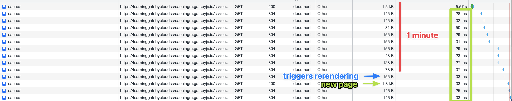

Ever since its introduction [Gatsby](https://gatsbyjs.com) has established itself as the standard solution for 
React-based [Jamstack](https://jamstack.org/what-is-jamstack/) architectures. But where this approach has proven to 
be quite powerful for smaller sites, the restriction to pre-build all pages using Static Site Generation has proven 
to be a bottleneck [for larger websites](https://www.gatsbyjs.com/docs/how-to/performance/improving-build-performance/)
or pages with real-time requirements.

Luckily the recent v4 update has added a couple of interesting new tools to the developer toolbox. One of them is 
[Server-Side Rendering](https://www.gatsbyjs.com/docs/how-to/rendering-options/using-server-side-rendering/). With 
SSR, pages are rendered on the server at the moment the user visits the page. This allows for greater scaling, 
as not all content pages need to be pre-rendered. Plus: this allows for additional features, like live-content or 
user-specific data.

> While this blog post focuses on Gatsby and Gatbsy Cloud it is applicable to any other SSR framework and hosting 
> solution that  supports the use of the caching headers mentioned in this article.

## Why is caching important?

When serving a page via SSR, efficient caching becomes crucial as the user won't see anything until the whole page 
is rendered on the server and delivered to the browser. If rendering also includes fetching some external data or 
doing some compute-heavy calculations, this can take multiple seconds. Despite this being generally bad UX, it can 
also become problematic for scaling and stability. That's where caching comes in place. Caching can be done on 
multiple levels, like only heavy computations. But the most impact on speed and scalability has caching at the edge, 
which means caching the whole rendered page on a CDN, right in front of the user.

If you host your Gatsby page with Gatsby Cloud, you have a CDN out of the box. The CDN is powered by Fastly. Caching 
for your static (SSG) or deferred ([DSG](https://www.gatsbyjs.com/docs/reference/rendering-options/deferred-static-generation/)) 
pages is done automatically. There is no need to configure anything here. But with SSR, you will need to configure 
the correct caching behavior by yourself.

## The Cache-Control header

Caching in Gatsby Cloud can be controlled via the HTTP caching header `Cache-Control`. This header has multiple 
[directives](https://developer.mozilla.org/en-US/docs/Web/HTTP/Headers/Cache-Control#directives) that can control caching. 
For our purposes the most important ones are:

- `max-age`: The time in seconds for how long the page should be cached by the browser. There won't be any network 
  requests during this time except the initial fetch.
- `s-maxage`: The time in seconds for how long the page should be cached by the CDN. For content that changes 
  frequently, you may want to set a smaller value. If content isn't expected to change it is safe to set a longer 
  time period. If not set, the CDN will default to `max-age`.
- `stale-while-revalidate` : Similar to `s-maxage` header, for the given time period all user-requests are served 
  instantly. But on top, the page is also refreshed in the background. If the requested page has been updated, the 
  cached version will be replaced and all subsequent requests will serve the most up-to-date version of the content.
  If the content is not crucial, you can set this to a very high value.

With those 3 directives, you can make your page as fast as with SSG or DSG pages. If the values are set correctly, 
only the very first user after a deployment will have to wait for the rendering. Everyone else will see a 
lightning-fast page.

> This post was inspired by the excellent video from [Remix on Youtube](https://www.youtube.com/watch?v=bfLFHp7Sbkg).
> If you want to deep dive into CDN caching, Cache-Control header and SSG/SSR, you should have a look!

## Implement caching with Gatsby

Now let's dive into the code and see how the `Cache-Control` header can be set with Gatsby.

```jsx
// pages/ssr.jsx
export default function Cache() {
  return (
      <h1>SSR: Server Side Rendering</h1>
  )
}

export async function getServerData() {
  return {
    headers: {
      'Cache-Control': 'public, max-age=10, s-maxage=60, stale-while-revalidate=240',
    }
  }
}
```

Gatsby SSR pages export the `getServerData()` function which can be used to fetch data on the server-side or do other 
tasks necessary for rendering the page. This method is expected to return a `props` object, that will be injected 
into the page for rendering. But more importantly for our purposes, this function returns a `headers` object. This 
object is used to set the `Cache-Control` header.

In our case, we set the browser cache (`max-age`) to 10 seconds and the CDN cache (`s-max-age`) to 1 minute. After 1 
minute, the CDN will serve stale content. By adding the `stale-while-revalidate`-header we ensure, if there is 
any request within these 4 minutes, a new page will be rendered in the background while the old page gets served. 
After the new page is rendered, it will replace the old one on the CDN and the caching time starts again. Let's 
check the network tab to see if it works:



You can see: The very first page took 5 seconds to load (for this example, I added an artificial delay of 5 seconds 
to make the server rendered page more obvious). All other requests were served from CDN within 30ms. That's super 
fast! Also, after the stale page was served, the page was re-rendered in the background and replaced. The request 
after the stale one was super fast again and served the updated content.

## Lessons learned with Gatsby SSR

Before you jump into cached SSR pages on your production environment, keep in mind:

- SSR functionality is quite new in Gatsby and may not be as mature as in other frameworks.
- The same goes for Gatsby Cloud. It's quite new and doesn't feel fully ready for production just yet. E.g. during 
  testing - even with this simplified setup - we encountered a general server error with no feedback for the cause 
  (like server logs). The support of Gatsby is very helpful though. In doubt, you should contact them.
- SSR officially only works with Gatsby Cloud for now. You cannot host it somewhere else. There are third-party 
  plugins  though for [Fastify](https://github.com/gatsby-uc/plugins/tree/main/packages/gatsby-plugin-fastify) 
  (self-hosting) or [Netlify](https://github.com/netlify/netlify-plugin-gatsby) (SAAS).
- `gatsby-plugin-image` doesn't work with SSR.

## Conclusion

SSR with proper CDN caching is very powerful and can be used for a lot of scenarios, especially where you hit the 
limits of SSG and DSG. The integration within Gatsby and Gatsby Cloud is seamless, as you can introduce it on a per-page basis.
If you don't rely on `gatsby-plugin-image` too much, you should definitely give it a try.

Thanks for reading and have fun working with Gatsby SSR!

Check out the repository with a full example on [Github](https://github.com/feedm3/learning-gatsby-cloud-ssr-caching).