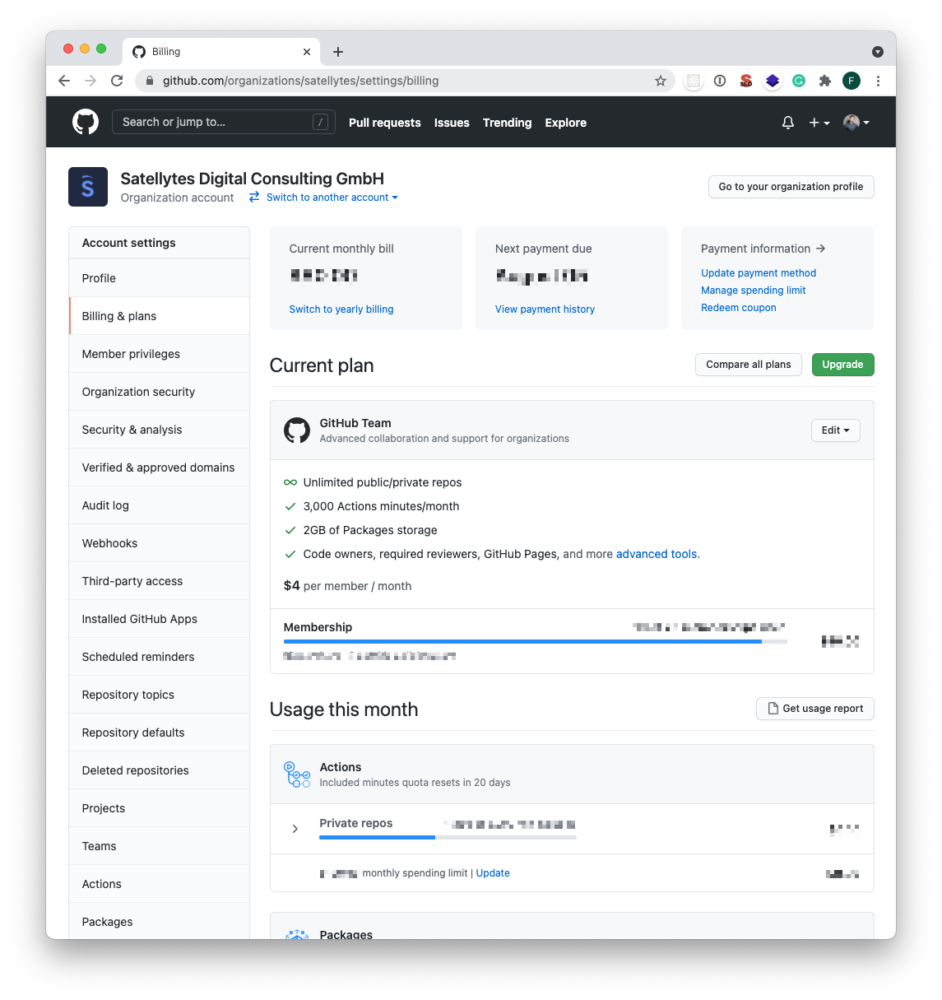
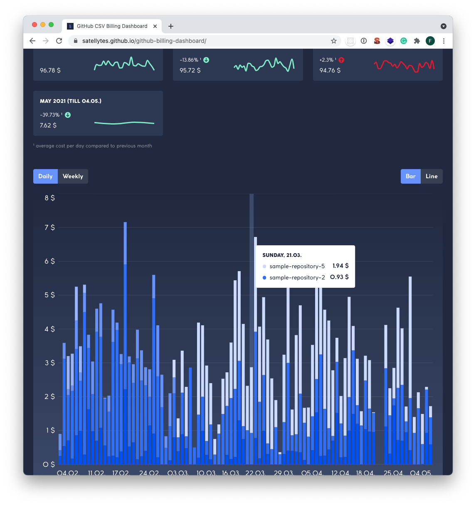

> You can try out the dashboard here: [https://satellytes.github.io/github-billing-dashboard](https://satellytes.github.io/github-billing-dashboard)

We use CI/CD pipelines and automatizations in every project we are responsible for. Especially GitHub Actions is becoming more popular, as it’s simple to use and growing in functionality. Over the last couple of months, we managed to create multiple projects and repositories that are using Github Actions extensively.

GitHub Actions provides a generous free tier, so costs for smaller projects are often nonexistent. Once you reach the free tier limits, every Action (and other services) needs to be "paid by use" at the end of the month. Github aggregates all costs and shows them in your settings. But Github doesn't provide charts or a dashboard to get into the details of the costs, for example for historical data.

This can be a problem if you have multiple projects, as it’s not obvious which service causes the costs. If you want to figure that out, you can get a CSV from Github, which is hard to read and analyze. We, therefore, decided to create a dashboard to visualize this CSV and show you the costs per repository and month.

The following screenshot shows all the billing information you get from the GitHub Settings. No historical data, no expense per service.



And this is what you get from the GitHub Billing Dashboard. Costs per service per month with historic data:

This blog post gives you some insights into how we build it.

## Technologies and Libraries

The dashboard runs locally in the user's browser and thus does not send any data to external servers, even the most recently used files are stored only in the browser's local storage. The dashboard was mainly developed with React and Typescript. For the styling of the dashboard, we used styled-components. In addition, we used various libraries:
+ papaparse
+ recharts
+ date-fns
+ react-medium-image-zoom 

In the following, the main functions of these libraries are discussed with concrete examples from our project.


### papaparse

[papaparse](https://github.com/mholt/PapaParse) is a CSV parser that converts CSV to JSON. Besides strings, papaparse can process CSV files directly, whether they are located locally on the computer or accessed via an external URL.

The following example shows how easy the conversion of a CSV file is. The function `parse()` is called with a file like `billing.csv`. Additionally, it needs as a second input parameter a config object, in which certain options for the parsing can be set. For example, the headings of the individual values are camalized here. The parsing itself, the assignment of the values to the headings, and the transformation into the `UsageReportCsvEntry` type are completely handled by papaparse. The parsed object can still be modified. In the sample code, you can see how in addition to the existing CSV file headers `totalPrice` is calculated and added to the finished object.

```
billing.csv

Date,Product,Repository Slug,Quantity,Unit Type,Price Per Unit,Actions Workflow,Notes
2021-06-14,actions,sample-repository1,21,UBUNTU,$0.008,.github/workflows/integration-test.yml,
2021-06-14,shared storage,sample-repository2,20.1028,gb,$0.25,,
2021-06-15,actions,sample-repository3,26,UBUNTU,$0.008,.github/workflows/main.yml,
2021-06-15,actions,sample-repository2,17,UBUNTU,$0.008,.github/workflows/integration-test.yml,
```

```tsx
export interface UsageReportCsvEntry {
	date: string;
	product: string;
	repositorySlug: string;
	quantity: string;
	unitType: string;
	pricePerUnit: string;
	actionsWorkflow: string;
	notes: string;
}

export interface UsageReportEntry extends UsageReportCsvEntry {
	totalPrice: number;
}

parse<UsageReportCsvEntry>(file, {
	header: true,
	skipEmptyLines: true,
	transformHeader: (header: string): string => {
		return camalize(header);
	},
	complete: (result) => {
			const githubBillingEntries: UsageReportEntry[] = result.data.map(
				(dailyEntry) => {
					return {
					...dailyEntry,
					totalPrice: parseFloat(dailyEntry.quantity) * parseFloat(dailyEntry.pricePerUnit),
				};
			}
		);
	},
});
```

### Recharts

Probably the most obvious feature of the dashboard is the functionality to display the costs in charts. For this, we used the React library [Recharts](https://github.com/recharts/recharts). This library comes with some handy features that were also important for this project. Besides the possibility to choose between different chart types (e.g. Bar or Line), Recharts also leaves a lot of room for customizing the charts. This includes, for example, various stylings, additional elements (e.g. tooltip, legend, ...), and the possibility to simply add features that are not available.

```tsx
<BarChart data={currentData} margin={{ bottom: 20 }}>
  <CartesianGrid vertical={false} stroke={"rgba(255, 255, 255, 0.1)"} />
  <XAxis
    dataKey={groupedBy === "daily" ? "day" : "week"}
    tick={{ fill: "white" }}
    axisLine={false}
    tickLine={false}
    minTickGap={10}
  />
  <YAxis
    domain={[0, maxValueOfYAxis]}
    unit=" $"
    tickCount={maxValueOfYAxis + 1}
    tick={{ fill: "white" }}
    axisLine={false}
    tickLine={false}
  />
</BarChart>
```

### date-fns

For grouping costs by days, weeks and months we had to work a lot with dates. The library [date-fns](https://github.com/date-fns/date-fns) made this work easier for us because it brings important functions like `startOfMonth()`, `getISOWeek()`, or `lightFormat()`, which allows you to customize the date format easily. For example, we used the `lightFormat()` function to display the start or end date of the data set. Due to the detailed documentation, it was very pleasant to work with date-fns.

```tsx
isFirstMonth()
	? ` (from ${lightFormat(new Date(firstDayOfMonth), "dd.MM.")})`
	: ""
isLastMonth()
	? ` (till ${lightFormat(new Date(lastDayOfMonth), "dd.MM.")})`
	: ""
```

### react-medium-image-zoom

[React-medium-image-zoom](https://github.com/rpearce/image-zoom) is a small but very useful library to zoom in images that are clicked. This library also leaves many possibilities for customization, for example, the background of the zoomed image and the zoom effect can be customized very easily. For the basic function of react-medium-image-zoom it is sufficient to just wrap an image or div tag with the `<Zoom>` tag as shown in the example below. The customization features can be added via props.

```tsx
<Zoom>
	
</Zoom>
```

### GitHub Pages deployment

We chose GitHub Pages to host the page, as it's a simple and free hosting solution. It was important to us that new features are deployed automatically to GitHub Pages. To automate this process, we decided to use the GitHub Actions with [GitHub Pages Deploy Action](https://github.com/JamesIves/github-pages-deploy-action).
This ensures that with every commit to a selected branch (in our case to `main`), the new version is automatically deployed to the `gh-pages` branch. Thereby all changes are immediately visible to the user and can be used directly. By using this plugin we also didn't need to change any scripts or code we didn't already have.

So, if you have a React SPA you can just copy & paste the GitHub Action and start deploying to GitHub pages. You only need to change the `PUBLIC_URL` variable to your GitHub Pages deployment URL:

```yaml
name: Deploy to gh-pages

on:
  push:
    branches: [main]

jobs:
  build-and-deploy:
    runs-on: ubuntu-latest
    steps:
      - name: Checkout 🛎️
        uses: actions/checkout@v2.3.1

      - name: Install and Build 🔧
        run: |
          npm install
          npm run build
        env:
          PUBLIC_URL: /github-billing-dashboard

      - name: Deploy 🚀
        uses: JamesIves/github-pages-deploy-action@4.1.3
        with:
          branch: gh-pages
          folder: build
```


## Conclusion
The CSV file from GitHub provides a lot of detailed information about the incurred costs but no graphical representation. The GitHub Billing Dashboard makes it possible to present this information in a meaningful and informative way to the user. The libraries discussed here have made the development of the dashboard much easier and have resulted in the project being a lot of fun for us.  Any feedback or new ideas on this project would be greatly appreciated.