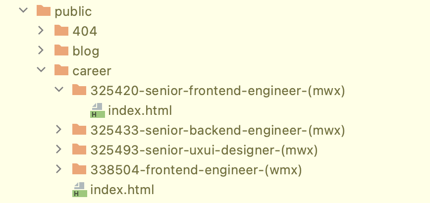
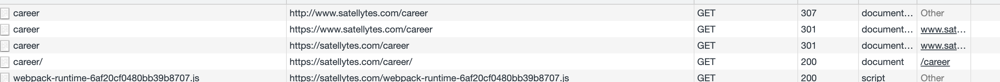

We did a deep dive into how to work with URLs in Gatsby to improve UX and search engine ranking. See what we have 
learned and how you can improve your Gatsby site too.

<!-- stop excerpt -->

## The problem

If you create a page in Gatsby, the page will be created as `index.html` in a folder that has the same structure as the URL path itself. For example, our position as Senior Frontend engineer has the path `career/325420-senior-frontend-engineer-(mwx)`, which makes Gatsby create an `index.html` in a folder with the same name.



Depending on the webserver you are using, the `index.html` file is accessible via different URLs. We are using Netlify which allows 12 different URLs:

- [https://satellytes.com/career/325420-senior-frontend-engineer-(mwx)](https://satellytes.com/career/325420-senior-frontend-engineer-(mwx))
- [https://satellytes.com/career/325420-senior-frontend-engineer-(mwx)/](https://satellytes.com/career/325420-senior-frontend-engineer-(mwx)/)
- [https://satellytes.com/career/325420-senior-frontend-engineer-(mwx)/index.html](https://satellytes.com/career/325420-senior-frontend-engineer-(mwx)/index.html)
- all 3 links above, but starting with `https://www.`
- all 3 links above, but starting with `http://`
- all 3 links above, but starting with `http://www.`

In general, it's good that all links are supported, as it lowers the possibility of a wrong URL entered by the user. But it also comes with 2 downsides:

1. Degraded performance for the user as only one link returns the HTML file directly. All other links are redirects.
2. Duplicate content for search engines. A page should only have one URL (or at least one "original" URL)

## Optimize URLs for the user

If you use Netlify for hosting, only one URL delivers the actual HTML file, and that's the URL with `https`, no `www.`  and a trailing slash. All other URLs will be redirected. In the worst case, you have 3 redirects before the user will get the HTML file:



1. `307` redirect from `http` to `https`
2. `301` redirect from `www.` to plain URL
3. `301` redirect from missing trailing slash to `/`
4. `200` with the HTML document 🎉

The URLs that the users are using are the ones we put on our website. That's why we should make sure to always use the direct URL. We did this by creating a general `Link` component, that we use for all links we put on our side. It looks something like this:

```tsx
import { Link as GatsbyLink } from 'gatsby';

export const Link = (props: LinkProps): JSX.Element => {
  const {
    to,
		children,
		...rest
  } = props;

  const isExternalLink = to.toString().startsWith('http');
  if (isExternalLink) {
    return (
      <a
        href={to}
        target="_blank"
        rel="noopener"
        {...rest}
      >
        {children}
      </a>
    );
  }

  // here we add the traling slash for every URL we put into a link
  const toWithSlash = to.endsWith('/') ? to : `${to}/`;

  return (
    <GatsbyLink
      to={toWithSlash}     
      {...rest}
    >
      {children}
    </GatsbyLink>
  );
};
```

> Check out the full component implementation on our public website repository: [https://github.com/satellytes/satellytes.com/blob/main/src/components/links/links.tsx](https://github.com/satellytes/satellytes.com/blob/main/src/components/links/links.tsx)

With this component, we get consistency into our URLs (inconsistent URLs could come from authors or developers by accident). The trailing slash will be appended to all internal links and users don't have to deal with redirects - at least when they open the link in a new tab or share it to their friends, as client-side routing with `GatsbyLink` is not affected by this. Having all URLs aligned also helps us with SEO, which we go into detail in the next paragraph.

The component also takes care of handling [external and internal links](https://www.gatsbyjs.com/docs/linking-between-pages/) in a central place, as only internal links need to be wrapped by `GatsbyLink`.

## Fix URLs for search engines

Now that we have consistent URLs on our website, we also want to have consistent URLs for search engines to improve our search ranking. This means we need to put the correct URLs into the `sitemap.xml` and in the canonical header on each page.

### sitemap.xml

A sitemap is a list of all of the pages you have on your website. Using the `[gatsby-plugin-sitemap](https://github.com/gatsbyjs/gatsby/tree/master/packages/gatsby-plugin-sitemap)` makes it easy to generate one. The plugin iterates over all pages that were created and puts the path into the `sitemap.xml`.

After checking our `sitemap.xml`, we figured out that some URLs in there didn't have a trailing slash. Turns out: We were not using the `createPage` consistently. The sitemap plugin takes the `path` variable exactly as it is defined in the `createPage` function. The fix was to check all function calls (we have them all in `gatsby-node.js`) and make sure that a trailing slash was passed:

```diff
createPage({
-  path: '/career',
+  path: '/career/',
  component: CAREER_TEMPLATE_PATH,
  context: {
    positions: positions,
  },
});
```

Out sitemap URLs now match all internal links we have on our page.

Bonus: We use the sitemap plugin to check if all pages have a trailing slash. It's probably not the very best place to do so, but also not the worst. It does its job as all URLs will pass this plugin:

```jsx
{
  resolve: `gatsby-plugin-sitemap`,
  options: {
    resolvePagePath: ({ path }) => {
      if (!path.endsWith('/')) {
        console.warn(
          'Path of the page does not end with a slash! For SEO reasons all paths should end with a slash:',
          path,
        );
      }
      return path;
    },
  },
},
```

If there is a path without a trailing slash, you will now get a warning in the console during a build. We don't add the trailing slash here, as the problem should be solved at the root - paths without a trailing slash will lead to potential follow-up problems.

**Canonical**

A canonical URL is like an ID for a page. If your page has multiple URLs for the same page, the search engine uses the canonical URL to match them together. If the document wouldn't have a canonical URL, the search engine marks the content as duplicate content and lowers the search ranking.

To add a canonical to all our pages, we use the `[gatsby-plugin-canonical-urls](https://github.com/gatsbyjs/gatsby/tree/master/packages/gatsby-plugin-canonical-urls)` plugin. Like the sitemap plugin, it takes the path of the page and puts it into the header. As we fixed all our paths already in the sitemap part above, the paths that are used as canonical are all correct now.

With the canonical URL in the header, it's not a problem anymore for search engines that our pages have multiple URLs to reach them. As Netlify does a redirect for all URLs except one, this should be a problem in the first place. But depending on the webserver, this isn't always the case and although the redirects are correct in our case, the Google Search Console marked some URLs as duplicated content. You can read more about this topic on the Google documentation: [https://developers.google.com/search/docs/advanced/guidelines/duplicate-content](https://developers.google.com/search/docs/advanced/guidelines/duplicate-content)

## Conclusion

Consistency in URLs is important for UX and search engine rankings. To improve the consistency:

1. Decide for one format - usually, the best format is given by the webserver or hoster
2. Create a common `Link` component to ensure the formatting of internal links on your website
3. Align all `createPage` function calls for a correct `sitemap.xml` and canonical URL
