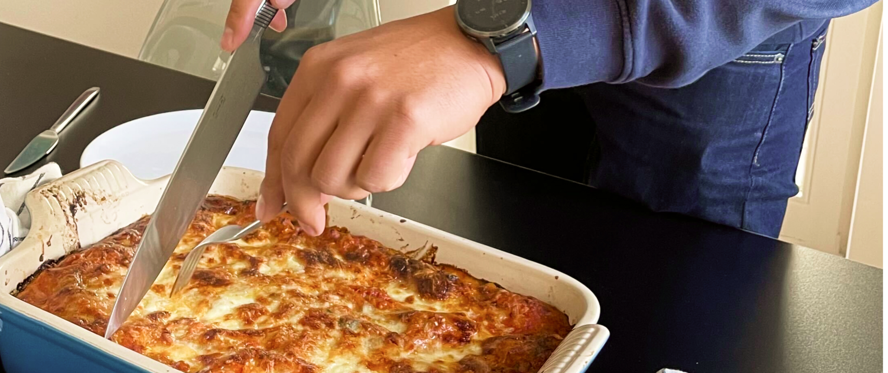
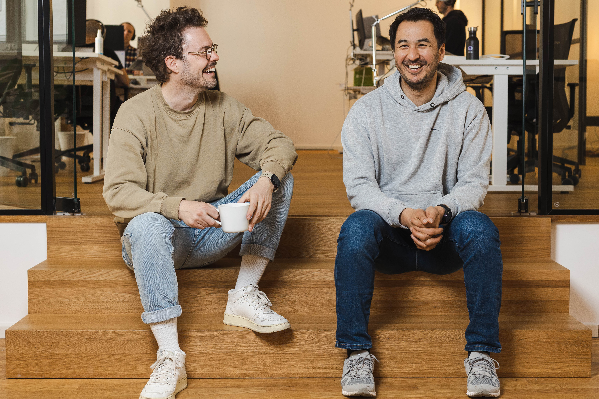
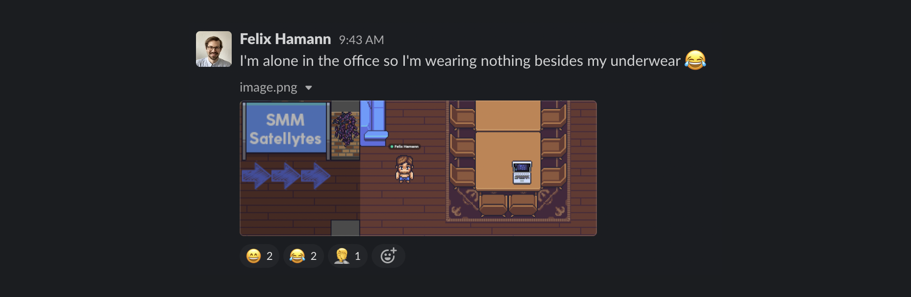

Mit dem Ausklingen der verpflichtenden Corona-Maßnahmen endet in vielen Unternehmen die Home-Office-Pflicht – auch bei Satellytes. Und so freuen wir uns das neue Büro wieder für alle Mitarbeiter:innen öffnen zu können.

Jedoch haben die letzten beiden Jahre bei vielen Angestellten ein Umdenken in der Einstellung zum Verhältnis von Büroarbeit zu Home-Office bewirkt. Viele stellen sich die Frage: Muss ich bald wieder regelmäßig ins Büro oder kann ich weiter remote arbeiten?

Wir dachten, das ist genau der richtige Zeitpunkt unsere Geschäftsführer mal zu fragen: Wie steht ihr dazu? Do we work remotely? Wie wird die Zusammenarbeit nach Ende der Corona-Einschränkungen bei Satellytes aussehen?

**Fangen wir mal mit euch persönlich an: Wie plant ihr zukünftig euren eigenen Arbeitsalltag zu gestalten? Werdet ihr wieder täglich vom Büro aus arbeiten? Wird es Remote-Anteile geben?**

**Gholam:** Ich plane wieder relativ häufig, wenn nicht sogar täglich, vom Office aus zu arbeiten.
Ich habe festgestellt, dass meine Effektivität abnimmt, je länger ich gezwungen bin im Home-Office zu arbeiten. Mir hilft der regelmäßige Wechsel ins Office enorm, mich auf die Arbeit einzustellen.
Es wird aber kein typischer Arbeitstag mit regulären Zeiten werden – das war es ja vor der Pandemie auch nicht. Mir war es schon immer wichtig, meine Arbeitszeiten im Einklang mit meiner Familie zu gestalten. Wenn ich z.B. meinen Sohn früh morgens in die Schule gebracht habe, hat mein Bürotag auch erst mal um 10 Uhr angefangen. Das war dann halt so. Und das war auch gut so.

**Eric:** Ich sehe das ganz ähnlich: Auch ich werde wieder größtenteils vom Büro aus arbeiten. Es wird aber auch Ausnahmen geben: Wenn ich mich bspw. auf ein komplexes, operatives Thema konzentrieren muss, werde ich auch in Zukunft von zu Hause aus arbeiten. Die letzten beiden Jahre haben mir gezeigt, dass es sehr effektiv sein kann Slack und Telefon für ein paar Stunden abzuschalten. Dieses "von der Außenwelt abschotten" ist im Büro natürlich nicht möglich, aber ich freue mich trotzdem sehr, wieder enger mit den Kolleg:innen im Büro arbeiten zu können.

**Welche Vorteile seht ihr für euch, wenn ihr aus dem Büro arbeitet?**

**Gholam:** Das Office bietet viele Kommunikationsformen an, die man nur sehr schwer remote nachbilden kann. Wenn ich z.B. jemanden, mit dem ich in letzter Zeit eher wenig Kontakt hatte, an der Kaffeetheke treffe, frage ich direkt mal nach: “Wie geht’s dir? Wo kann ich dir helfen?” So bekomme ich ein besseres Gefühl, wie es unseren Kolleg:innen geht. Das ist mir schwer gefallen remote in derselben Qualität abzubilden.
Ich will auch sicherstellen, dass ich für alle bestmöglich verfügnbar bin. Manche ziehen es auch aktuell vor täglich oder teilweise vom Büro aus zu arbeiten. Da sehe ich es als meine Pflicht an, dass ich auch für sie auf ihrem bevorzugten Kanal erreichbar bin.

**Die letzten beiden Jahre waren ja sehr herausfordernd. Auch unsere Kunden haben unter den Einschränkungen gelitten, die sich dann natürlich auch auf uns ausgewirkt haben. Trotzdem haben wir das als Mitarbeiter:innen kaum gespürt. Wie seht ihr das selbst? Wie hat sich Satellytes in der Zeit entwickelt?**

**Eric:** Trotz der Umstände, waren die beiden Jahre für uns als Firma positiv. Wir stehen finanziell solide da. Aber ja, wir haben es auch an einigen Stellen gespürt, dass es Einschränkungen in den Budgets unserer Kunden gab.
Aber dennoch hat uns die Zeit gut getan. Wir konnten unsere Projekte und Kundenbeziehungen konsolidieren und haben uns auf persönlicher Ebene, aber auch als Firma, weiterentwickelt.
Noch wichtiger war aber, dass wir es geschafft haben uns an die neuen Bedingungen anzupassen um damit den Kunden zu zeigen, dass wir auch unter diesen neuen Voraussetzungen sehr gute Ergebnisse liefern können.

**Gholam:** Ich fand die letzten beiden Jahre überragend. Wir haben als Firma und in den Teams sehr gut funktioniert. Wir haben alle unserer Projekte gestemmt und auch die Phasen, in denen in der Industrie große Unsicherheit bestanden hat, gut gemeistert. Auch in der Phase Anfang 2020 wo das Auftragsvolumen erst einmal deutlich eingebrochen ist, konnten wir relativ schnell wieder zu 100% Auslastung zurückkehren. Das lag vor allem auch an unseren Kolleg:innen, die auf die Situation gut reagiert haben. Top!
Unser Konzept bei der Einstellung von Mitarbeiter:innen hat sich gerade in dieser Situation als absolut richtig erwiesen. Gerade weil wir durchweg Leute in der Firma haben, die eigenverantwortlich arbeiten, die über den Tellerrand hinaus schauen können, die mitdenken und aus eigenem Antrieb Anderen helfen, haben wir die herausfordernde Situation der letzten beiden Jahr so gut bewältigen können.

**Wie produktiv war die Arbeit vom Home-Office aus? War das für euch befriedigend?**

**Eric:** Die Produktivität in Bezug auf die Arbeit war sicher sehr gut. Aber befriedigend? Für mich persönlich war das teilweise total unbefriedigend … Weil man bei all den Erfolgen, die wir als Firma feiern konnten, nie die Gelegenheit hatten, im Team mal echte High-Fives zu verteilen und gebührend zu feiern (lacht).

**Gholam:** Ich empfand die beiden Jahre auch sehr produktiv. Das liegt natürlich daran, dass der Anteil am produktiven Output im Verhältnis zur Arbeitszeit gestiegen ist. Einfach weil der Coffee-Talk häufiger weggefallen ist und man sich voll auf die Arbeit konzentrieren konnte.
Ob das für den Einzelnen befriedigend war, kann man so eindeutig nicht beantworten. Auf der einen Seite war die Gesamtsituation natürlich sehr belastend. Auf der anderen Seite hat sich auch die Perspektive auf die Arbeit, auf Work-Life-Balance, auf Remote-Arbeit zum Besseren verändert.

**Eric:** Insgesamt würde ich die Frage ob “befriedigend” so auch nicht beantworten können. Die Jahre waren eben einfach herausfordernd. Man konnte sich nicht mehr auf bewährte Prozesse verlassen, sondern musste neue definieren. Das ist uns aber recht gut gelungen.

**Neben der Frage, wie produktiv wir arbeiten, gibt es ja auch andere Faktoren, die ausmachen, ob und wie wir als Team gut funktionieren. Wie habt ihr die Entwicklung der Firmenkultur unter diesen Voraussetzungen empfunden? Das war doch sicher auch eine ganz spezielle Herausforderung?**

**Gholam:** In der aktuellen Teamzusammensetzung war unsere Vorstellung von Kultur schon so weit verinnerlicht, dass diese beim Wechsel ins Home-Office einfach erhalten und weitergelebt werden konnte. Dabei geht es mir vor allem darum wie wir im Team miteinander umgegangen sind. Das hat auch remote sehr gut geklappt.
Nur mal als Beispiel: Fabian hat sich bereit erklärt die Weihnachtsfeier zu planen und Jesús hat sich die Onboarding-Prozesse vorgenommen und optimiert. Das musste nicht von uns vorgegeben werden, sondern ist von den Kolleg:innen eigenverantwortlich vorangetrieben worden.

**Eric:** Klar auf der zwischenmenschlichen Ebene oder innerhalb der Teams hat das weiterhin sehr gut funktioniert. Die Teams haben schnell gemerkt, dass sie sich die Zeit nehmen müssen und auch dürfen, auch mal über Dinge außerhalb der Arbeit zu plaudern.
Aber trotzdem habe ich persönlich vieles vermisst, was vor Corona selbstverständlich war. Man trifft sich zwar immer noch häufig in Zoom-Meetings, aber da hat man immer eine Agenda. Der kurze Small-Talk am Anfang und am Ende ist für mich kein Ersatz für die längeren Zusammentreffen, die im Büroalltag ständig zustande kommen.
Vor Corona ist es schon regelmäßig passiert, dass man sich mal in der Küche über den Weg gelaufen ist und sich dann auch mal länger über irgendein Casual-Thema unterhalten hat. Außerdem sind wir auch ständig gemeinsam zum Mittagessen gegangen. Dabei hat man mehr Zeit gefunden über Dinge zu reden, die über die aktuellen Projektthemen hinausgehen. Und genau diese Feinheiten und Hintergründe braucht es, damit wir auf unsere Kolleg:innen richtig eingehen und bei Bedarf helfen können.

**Die Home-Office-Pflicht ist ja vor kurzem ausgelaufen. Trotzdem überlegen viele, wie sie zukünftig arbeiten wollen. Welche Gründe seht ihr, warum die Leute vom Büro aus arbeiten wollen?**

**Gholam:** Die Motivation dazu ist meiner Meinung nach sehr von den individuellen Vorlieben und Voraussetzungen eines jedes Einzelnen abhängig. Wir spüren zum Beispiel, dass viele auch einfach Lust darauf haben, ihre Kolleg:innen wieder häufiger zu sehen um unmittelbarer zusammenarbeiten oder auch mal nur gemeinsam Mittag essen gehen zu können.
Man sieht auch, dass nicht bei allen der Platz oder das Umfeld gegeben ist um entspannt von zu Hause aus arbeiten zu können. Wenn ich in meiner Wohnung wenig Platz habe und jeden Mittag die Kinder von der Schule kommen und beschäftigt werden wollen, bin ich wahrscheinlich auch einfach froh darüber einen ruhigen Ort – in dem Fall das Büro – zu haben, von dem aus ich konzentriert arbeiten kann.

**Welche konkreten Vorteile seht ihr darin, wenn wieder mehr Kolleg:innen häufiger gemeinsam vom Büro aus arbeiten?**

**Gholam:** Mein Essen am Montag! Das ist ein klarer Vorteil, wenn ich Montags für alle koche (lacht). In Zeiten von Corona mussten wir das leider pausieren. Aber das plane ich auf jeden Fall wieder aufzunehmen.

**Eric:** Ja, die Lasagne war genial! Dafür habe ich sogar den Schnitt im Daumen in Kauf genommen (lacht). Das war eine tolle Sache.
Aber im Ernst: Ich glaube, dass das komplett vom Typ abhängig ist. Manche Leute _wollen_ auch wieder mehr vom Büro aus arbeiten, weil sie wieder regelmäßig den Austausch mit ihren Kolleg:innen haben wollen. Ich glaube tatsächlich, dass die Social Benefits von zentraler Bedeutung sind.

**Gholam:** Ich stimme da voll mit Eric überein. Ich glaube tatsächlich, dass der Spaß bei der gemeinsamen Zusammenarbeit eine wichtige Voraussetzung dafür war, dass es auch remote so gut geklappt hat. Deswegen sehe ich es als elementar wichtig an, dass man sich auch zukünftig wieder trifft. Dann habe ich auch keine Sorgen, dass die Zusammenarbeit anschließend unabhängig vom Ort gut funktioniert.
Klar, kann das auch bedeuten, dass vom Büro aus nicht so effizient gearbeitet wird, als dies im Home-Office der Fall wäre. Aber ich bin bereit diesen Effizienzverlust in Kauf zu nehmen, wenn es bedeutet, dass wir als Team enger zusammen rücken und langfristig besser und zufriedener zusammen arbeiten können.

**Eric:** Darüber hinaus hilft natürlich die räumliche Nähe bei der Zusammenarbeit zwischen den Disziplinen. Wenn ich z.B. Felix auf dem Weg in die Küche sehe, fällt es mir wahrscheinlich eher mal ein zu fragen “Hey, brauchst du eigentlich noch eine Design Review? Kann ich dir irgendwie helfen?”
Und diese ganzen bilateralen Kleinigkeiten abseits von Terminen lassen so ein schönes Gefühl von Fürsorge entstehen, die nicht nur beruflich, sondern auch privat ein Gemeinsamkeitsgefühl und eine Zusammengehörigkeit entstehen lassen. Davon profitiert jeder.
Und wenn man zusammen im Office arbeitet, hat man auch mehr das Gefühl, dass um einen herum was passiert – wie in einem Bienenstock, da hört und sieht und spürt man dieses motivierende Summen.

**Habt ihr konkrete Ideen, was ihr tun wollt um die Leute davon zu überzeugen das Home-Office gegen das Büro auszutauschen?**

**Eric:** Wir haben in den letzten Monaten viel Energie in unser Office investiert. Schallschutz, gutes Licht, neue Räume mit Rückzugsmöglichkeiten, damit man in jeder Situation und Konstellation gut arbeiten kann. Und neben den regulären Arbeitsplätzen gibt es jetzt auch mehr coole Bereiche mit Sesseln und Poufs und ein paar Konsolen und Spiele, wo man auch mal entspannen und einen guten Kaffee genießen kann.

Unsere Kolleg:innen sollen sich da einfach wohlfühlen, sie verbringen ja schließlich fast die Hälfte ihrer wachen Zeit im Office.
Deswegen hören wir auch auf ihre Ideen und Bedürfnisse. Wenn Pavel zum Beispiel ein neuer Pizzaschneider hilft eine noch bessere Zeit beim Mittagessen im Büro zu haben, wird einer gekauft (lacht).

**Gholam:** Ganz generell schreiben wir den Community-Gedanken ganz groß. Deswegen wird es auch in Zukunft gemeinsame Events geben. Zum Beispiel organisiert Georgios gerade ein virtuelles Exit the Room. Es gab auch schon Brettspielabende mit neuen, spannenden Spielen. So können die Leute, die das möchten, das Office auch als mehr als nur als Arbeitsort erfahren. Das ist natürlich alles freiwillig, aber das Feedback dazu war bisher sehr gut.
Darüber hinaus planen wir zukünftig regelmäßig sogenannte “Company Space Days”. Das werden Tage sein, wo man sich gemeinsam mit einem Thema beschäftigt, das einmal nichts mit der Arbeit zu tun hat. Das kann z.B. sein, dass man gemeinsam einen R2D2 baut (beide lachen) … Voraussetzung ist, dass es eine Idee ist, die Abwechslung in den Büroalltag bringt. Das soll gezielt nichts mit den Themen und Technologien zu tun haben, mit denen wir tagtäglich arbeiten.

**Welche Gründe glaubt ihr haben eure Kolleg:innen, trotzdem weiter remote arbeiten wollen?**

**Eric:** Ruhe. Zu Hause fällt es vielen einfacher, in den “Tunnel” zu kommen. Ich glaube aber auch, dass es einfach Bequemlichkeit ist bzw. “Convenience”, hört sich schöner an (lacht). Ich muss mich nicht erst morgens duschen, waschen, anziehen, fertig machen und in die Arbeit commuten.

**Gholam:** (lacht) Jetzt überträgst du von dir auf andere!

**Eric:** Nein, aber mal ehrlich ... Ich kann morgens direkt den Rechner aufklappen und bin voll im Fokus und kann dann Pause und meine Morgenroutine machen, wenn die Konzentration das erste Mal nachlässt. Wenn ich vom Büro aus arbeite, ist mein Morgen weniger flexibel planbar.
Allgemeiner gefasst, kann man sagen: Die Remote-Arbeit erlaubt jedem, die eigene Routine zu finden, die am besten geeignet ist um gut und effizient arbeiten zu können.

**Gholam:** Darüber hinaus glaube ich, dass vor allem die freie Ortswahl ein Grund ist, dass die Leute Gefallen an der Remote-Arbeit gefunden haben. Arthur z.B. hatte vor der Pandemie jeden Tag 70 Kilometer zur Arbeit gehabt. Das sind bis zu zwei Stunden, die täglich verloren gehen. Nach zwei Jahren funktionierendem Home-Office, stellt sich dann natürlich die Frage: Ist das wirklich jeden Tag nötig?
Damit einher geht die bessere Vereinbarkeit von Familie und Beruf. Ich kann mich noch an Projekte erinnern, wo es Pflicht war spätestens um 9:00 Uhr vor Ort zu sein und in die Tasten zu hauen.
Zu der Zeit, musste ich jeden Morgen vor der Arbeit meinen Sohn zur Kita bringen. Das hieß morgens mit S-Bahn, Bus und zu Fuß von Milbertshofen im Norden nach Untermenzingen in die Kita. Danach dann mit Bus und S-Bahn zur Arbeit. Das war schon ein brutaler Stress, den ich jeden Morgen hatte. Praktisch hieß das, dass ich spätestens um 7:00 Uhr das Haus verlassen musste, damit ich auch garantiert um 9:00 Uhr pünktlich im Büro sein konnte.
Wenn so ein Zwang wegfällt, ist man automatisch entspannter und kann mehr Energie in die Arbeit investieren.

**Was plant ihr für die “Rückkehr zum Arbeitsplatz”? Wird es Vorgaben geben, was den Arbeitsort angeht?**

**Gholam:** Das werden wir unseren Kolleg:innen komplett frei stellen. Wir wollen da keine festen Vorgaben machen. Von Vollzeit-Remote, Vollzeit-Büro und allem was dazwischen denkbar ist, werden wir allen die Freiheit geben, ihren Arbeitsrhythmus so zu planen, dass sie gut arbeiten können.

**Eric:** Genau. Als Ausnahme sehe ich persönlich Senior- und Manager-Pflichten. Sobald juniorige Mitarbeiter betreut werden, muss sichergestellt sein, dass das bestmöglich klappt.
Wenn das rein remote funktioniert – super. Falls nicht, hoffen wir, dass sie einen gemeinsamen Ort finden, an dem zumindest zeitweise Seite an Seite gearbeitet werden kann. Gerade Berufseinsteiger profitieren enorm davon, wenn sie neben erfahrenen Kolleg:innen arbeiten. Sie können so schneller Fragen stellen und Hilfe bekommen. Davon kann ihre Entwicklung sehr profitieren. Wenn du Verantwortung für deine Kolleg:innen hast, musst du sicherstellen, dass das für sie bestmöglich funktioniert.
Aber ich glaube, das kommt von ganz alleine. Es ist doch wahnsinnig befriedigend, wenn man den Lerneffekt beim jemandem unmittelbar mitbekommt und sieht wie sie/er sich weiterentwickelt.
Insgesamt vertrauen wir, was die Frage angeht, ganz auf unsere Mitarbeiter. Wir helfen gerne mit Rat, aber geben nichts vor. Wichtig ist nur, dass es funktioniert.

**Klingt gut. Wie wirkt sich das zukünftig auf die Besetzung offener Stellen aus? Von Vollzeit-Office bis Vollzeit-Remote alles möglich?**

**Gholam:** Definitiv, ja. Du warst ja der erste Angestellte, bei dem bei der Einstellung schon feststand, dass du Vollzeit-Remote von Fulda aus arbeiten wirst. Diesen Monat konnten wir Julian als zweiten Vollzeit-Remote für uns gewinnen. Das funktioniert bisher bestens. Deswegen suchen wir jetzt deutschlandweit nach Mitarbeiter:innen, die nicht in München leben und auch nicht für die Arbeit dorthin umziehen wollen.

**Danke, Eric und Gholam für den Einblick in eure Erfahrungen und Erwartungen zur Corona- und Return-to-Office-Situation.**
**Ich persönlich freue mich schon sehr darauf euch alle bald wieder persönlich im neue Office sehen zu können!**
**Dafür fahre ich auch gerne mal wieder nach München!**
