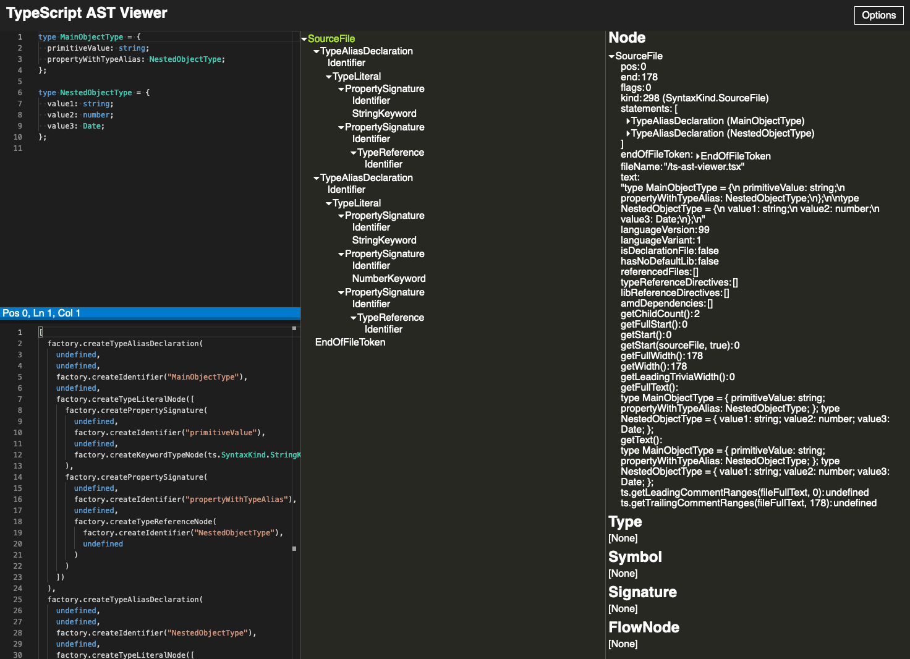

We currently develop a [low-code platform](https://en.wikipedia.org/wiki/Low-code_development_platform) for an enterprise client where Angular components are arranged and connected based on a given configuration file. The components define *data contracts* based on [generics](https://www.typescriptlang.org/docs/handbook/2/generics.html) so the platform always knows what data can flow between them. In order to perform the actual type check we use a json file that already contains all relevant typing information. We collect the typing data by recursively resolving typescript types down to their primitives and then store the found property names along with their typing name. This post is about how to collect the typing information and why we need to go beyond the AST to achieve this.

<!-- stop excerpt -->

You can find the repository on [github.com/georgiee/typescript-type-checker-beyond-ast](https://github.com/georgiee/typescript-type-checker-beyond-ast) and you can directly run the given example in your browser with [code sandbox](https://githubbox.com/georgiee/typescript-type-checker-beyond-ast)


## Expectations

Look at the two types below. You can find primitives like `string` and `number`, types from the standard library such as `Date` and type aliases like `NestedObjectType` that refers to object types which are assembled types that can contain primitives and other object types.

```typescript

// we will start our inspection here
type MainObjectType = {
  propertyWithTypeAlias: NestedObjectType;
};

type NestedObjectType = {
  value1: string;
  value2: number;
  value3: Date;
};

```

The ideal output we want to get for the above content is a list of property names and type names separated by a colon including the hierarchy to visualize where a property belongs to. 

```
MainObjectType:
  propertyWithTypeAlias: NestedObjectType
        value1: string
        value2: number
        value3: Date
```

Those are our rules for the processing:

+ [Type aliases](https://www.typescriptlang.org/docs/handbook/2/everyday-types.html#type-aliases) such as `propertyWithTypeAlias: NestedType` need to be resolved into the types that are referred to. This can be other type aliases or primitives.
+ Primitives itself can't be processed anymore and should be output as is such as `value1: string` and `value2: number`.
+ We have no interest in type details from the [standard library](https://github.com/microsoft/TypeScript/tree/5afe42e14e61d7e4df5d75cc0022283711cb593a/lib) such as `value3: Date` or even `value1: string` with the `length` property. They potentially bring dozens of properties we don't want to see in our output list. 

Let's find out how we can approach this problem.

## Can we use the AST?
The [AST (Abstract Syntax Tree)](https://en.wikipedia.org/wiki/Abstract_syntax_tree) quickly comes to your mind to approach this problem. The AST is a data structure to represent the structure of your source file in a format readable by machines. Indeed, if I throw the above example in the [TypeScript AST Viewer](https://ts-ast-viewer.com) I get immediate access to the AST. 



That output looks promising. I guess this could work for very simple types 👍

The problem with the AST: it's a static analysis, which means you're processing code without executing it. That's why you are missing information from the runtime. Typescript needs to run the code to understand it and to add additional semantics. You will encounter the following problems when you try to approach the problem with the AST:

+ The AST can't see imported files as `import` statements are not processed
+ [Created types](https://www.typescriptlang.org/docs/handbook/2/types-from-types.html) with operands like `keyof` & `typeof` are constructed only during runtime
+ [Narrowing (type guards)](https://www.typescriptlang.org/docs/handbook/2/narrowing.html) or [conditional types](https://www.typescriptlang.org/docs/handbook/2/conditional-types.html) rely on being processed by typescript otherwise you have no chance to understand and process them

Eventually, the AST approach is a dead end.

## Walking beyond the AST

There must be another solution 🤔 Your favourite IDE does this type of processing all day, for instance when you are presented a list of inspections or completions for a given type. See the screenshot below, where I hovered over a type `NestedObjectType` in IntelliJ. IntelliJ somehow knows the details of that type which is exactly what we want to achieve here. 


That's a feature we take for granted from any IDE for any language it supports. How does the IDEs do this? Do they develop some magic analysis for every language they are going to support? There must be some tool to support the IDE given by the maintainers of the languages, in our case from the makers of TypeScript.

### Language Services & Checker

I researched the topic for a few exciting hours and found something important for my cause.

Your favourite IDE can support Typescript because TypeScript offers the [tsserver](https://github.com/Microsoft/TypeScript/wiki/Standalone-Server-%28tsserver%29) which is a *node executable that encapsulates the TypeScript compiler and language services*.

Have you ever restarted an ominous *Typescript Server* in IntelliJ or VSCode from time to time while debugging typing or tsconfig issues with typescript? That server is based on `tsserver` and offers optimized code completion support based on some technique we want to use to solve our problem. 

`tsserver` is as the name says a server though and not suited to process single files. If you look careful through the  [typescript architecture overview](https://github.com/microsoft/TypeScript/wiki/Architectural-Overview) you will notice a `checker.ts` at the foundation of the diagram — the core of typescript.


[checker.ts](https://github.com/microsoft/TypeScript/blob/5afe42e14e61d7e4df5d75cc0022283711cb593a/src/compiler/checker.ts) is a huge file in the typescript repository. Right now there are 42.000 lines of code, and it has a size of 2.5 MB 😳 This is probably the amount of code you would have to write atop of AST to properly process a given TypeScript file with the typings in its full glory.

I'm glad we finally found this magic ingredient, let's explore it.

### The Type Checker (checker.ts)

Let's dive into the type checker and see how it can help us with the given challenge. Unfortunately I couldn't find any documentation about the type checker which made it pretty difficult to get started. I mostly searched GitHub for some code examples, glimpsed through the file `checker.ts` itself and used the node `debugger` a lot to examine the content of the involved data. 

The following code shows the most crucial parts of type introspection with TS. Create a program, derive the checker and then use that checker for your analysis.

```typescript

const program: ts.Program = ts.createProgram(files, tsConfig);
const checker: ts.TypeChecker = program.getTypeChecker();

// Later involve the checker somehow 
const classSymbol = checker.getSymbolAtLocation(node.name);
// ...
```

## Type Checker Usage
Getting the checker setup is pretty straightforward, as usually it gets complicated with all the details. Let's tackle it step by step. We start by preparing a file `file-with-types.ts` that should contain the types we want to examine.


```typescript
// file-with-types.ts

type MainObjectType = {
  propertyWithTypeAlias: NestedObjectType;
};

type NestedObjectType = {
  value1: string;
  value2: number;
  value3: Date;
};
```

Together with this file, we want to answer the following question:

> Using `checker.ts`, how can we access the details of the type `NestedObjectType` so we know that the property `propertyWithTypeAlias` on `MainObjectType` has three distinctive nested properties?

First step is to create our type checker and retrieve the source file with `program.getSourceFile` which returns an instance of  `ts.SourceFile`.

```typescript
import * as ts from "typescript";

const files: string[] = ['file-with-types.ts']
const program: ts.Program = ts.createProgram(files, {});
const checker: ts.TypeChecker = program.getTypeChecker();

const mySourceFile: ts.SourceFile = program.getSourceFile('file-with-types.ts');
```

With our source file at hands we can dive into the file content. We have to use the AST first to reach the specific parts in the file and to tell the type checker about the parts we are interested in. When you invoke `ts.forEachChild((node: ts.Node) => {/*...*/})` you create a loop over all nodes (`ts.Node`) of your AST. Each node represents a specific position in the file together with all statically available information about that place (is it a `variable`, a `bracket`, where is the start, where the end; this is pretty common AST stuff).

> 👉 You should tinker around with [ts-ast-viewer.com](https://ts-ast-viewer.com) to get a better feeling for the AST structure

We want to start our type analysis at the type named `MainObjectType`. We can accomplish this by looking for the AST node named `MainObjectType` while looping over of all nodes in the file. 

```typescript
ts.forEachChild(mySourceFile, node => {
  if (ts.isTypeAliasDeclaration(node) && node.name.escapedText === "MainObjectType") {
    // [...process that type]
  }
});
```

`node` has the type `ts.Node` which doesn't have the property `node.name` instead you can check for the inherited type `TypeAliasDeclarations` with the method `ts.isTypeAliasDeclaration(node)`. This will type guard accessing `node.name` so typescript won't throw a typing error for `node.name` as you ensure the correct content.

By finding that AST node we have found the exact place in the source file to ask the type checker for more information. We can do this with the method `checker.getTypeAtLocation(node)`. We pass in the node and in return we get an instance of `ts.Type` from the checker. This is a specific object that contains added semantics, which we need to go beyond the AST.

```typescript
// Don't get confused, the `name` is not a string but an object with many more information
// That's why this works even for things that are named the same
const mainObjectType = checker.getTypeAtLocation(node.name);
```

This is it, we arrive in type checking land 🌈

## Analyzing the properties
We can access every property of the given type through `mainObjectType.getProperties()` and then find the name of the property as well as the name of the type.

```typescript
const [propertyWithTypeAlias] = mainObjectType.getProperties();
/**
 * `propertyType` will contain & reference everything
 * we can know about the type `NestedObjectType`
 */
const propertyType = checker.getTypeOfSymbolAtLocation(propertyWithTypeAlias, node);
const propertyTypeName = checker.typeToString(propertyType);
```

Remember we are currently processing the first level:

```
type MainObjectType = {
  propertyWithTypeAlias: NestedObjectType;
};
```

On that level we only have one property `propertyWithTypeAlias: NestedObjectType` in our original type definition, so we can save us one loop and simply extract the first element and name it `propertyWithTypeAlias`. The value has the type `ts.Symbol` which is similar to `ts.Type` a value with added semantics compared to the AST-related `ts.Node`.

We can use the symbol, to access the name of the variable and the actual name of the type. The type checker gives us the methods `getTypeOfSymbolAtLocation` and `typeToString` to do that, and we can print the final result to the console.

```typescript
// prints `propertyWithTypeAlias: NestedObjectType`
console.log(`${propertyWithTypeAlias.name}: ${propertyTypeName}`)
```

What's left is to dive one level deeper to finally extract the types from the nested `propertyWithTypeAlias: NestedObjectType`. This is basically *"rinse & repeat"* as you will see in the following code example. Instead of extracting the first element we use a for-loop though in order to find all properties.

```typescript
// remember we are now processing `ImportantValue` which is stored in `propertyType`
for (const nestedProperty of propertyType.getProperties()) {
  const nestedPropertyType = checker.getTypeOfSymbolAtLocation(nestedProperty, node);
  const nestedPropertyTypeName = checker.typeToString(nestedPropertyType);
  /** prints the following
   ├── value1: string
   ├── value2: number
   ├── value3: Date
   */
  console.log(`     ├── ${nestedProperty.name}: ${nestedPropertyTypeName}`)
}
```

<details>
    <summary>Full Example</summary>

````typescript
/**
 Given the following file 'file-with-types.ts'
 
  ```
     type MainObjectType = {
      propertyWithTypeAlias: NestedObjectType;
    };
    
     type NestedObjectType = {
      value1: string;
      value2: number;
      value3: Date;
    };
  ```
  
 This file will print the following information to the console.
    
  ```
     ── propertyWithTypeAlias: NestedObjectType
     ├── value1: string
     ├── value2: number
     ├── value3: Date
 ```

 */

import * as ts from "typescript";

const files: string[] = ['file-with-types.ts']
const program: ts.Program = ts.createProgram(files, {});
const checker: ts.TypeChecker = program.getTypeChecker();

const myComponentSourceFile = program.getSourceFile('file-with-types.ts')!;

ts.forEachChild(myComponentSourceFile, node => {
  if (ts.isTypeAliasDeclaration(node) && node.name.escapedText === "MainObjectType") {
    const mainObjectType = checker.getTypeAtLocation(node.name);
    const [propertyWithTypeAlias] = mainObjectType.getProperties();
    /**
     * `propertyType` will contain & reference everything
     * we can know about the type `NestedObjectType`
     */
    const propertyType = checker.getTypeOfSymbolAtLocation(propertyWithTypeAlias, node);
    const propertyTypeName = checker.typeToString(propertyType);
    // prints `propertyWithTypeAlias: NestedObjectType`
    console.log(`── ${propertyWithTypeAlias.name}: ${propertyTypeName}`)

    for (const nestedProperty of propertyType.getProperties()) {
      const nestedPropertyType = checker.getTypeOfSymbolAtLocation(nestedProperty, node);
      const nestedPropertyTypeName = checker.typeToString(nestedPropertyType);
      /** prints the following
       ├── value1: string
       ├── value2: number
       ├── value3: Date
       */
      console.log(`     ├── ${nestedProperty.name}: ${nestedPropertyTypeName}`)
    }
  }
});
````

</details>

## Real-world adjustments

The basic demonstration was specifically crafted to focus on the type extraction process. There are some important real-world issues left to tackle:

- We don't know the depth of our analysis, so it's a perfect match for recursion although you could construct a loop too I guess.
- We need to prevent diving into properties that are coming from the standard library like `Date` and methods or values of primitives like `string` because we are usually not interested in those properties. Same for external libraries (think of rxjs & friends).

### Recursion
First, let's make the analysis recursive to find every property in any given file.

```typescript
function processProperty(type: ts.Type, node: ts.Node, level = 0) {
  if(level === 0) {
    console.group(`.\n└──Processing '${checker.typeToString(type)}'`)
  }

  for (const property of type.getProperties()) {
    const propertyType = checker.getTypeOfSymbolAtLocation(property, node);
    const propertyTypeName = checker.typeToString(propertyType);

    processProperty(propertyType, node, level + 1)
    console.log(`  ├── ${property.name}: ${propertyTypeName}`)

  }
  console.groupEnd();

}

ts.forEachChild(myComponentSourceFile, node => {
  if (ts.isTypeAliasDeclaration(node) && node.name.escapedText === "MainObjectType") {
    const mainObjectType = checker.getTypeAtLocation(node.name);
    processProperty(mainObjectType, node);
  }
});
```

This will find every single property, no matter how deep it's nested. That's because `processProperty()` is used recursively on all nested properties.

When you run this code, you will be lost in noise. See the log below and try to spot our types (marked with `👉`) within the ocean of properties pouring in from the standard library.

<details>
<summary>Output with the noise of the standard library</summary>

```
.
└──Processing 'MainObjectType'
  ├── toString: () => string
  ├── charAt: (pos: number) => string
  ├── charCodeAt: (index: number) => number
  ├── concat: (...strings: string[]) => string
  ├── indexOf: (searchString: string, position?: number) => number
  ├── lastIndexOf: (searchString: string, position?: number) => number
  ├── localeCompare: { (that: string): number; (that: string, locales?: string | string[], options?: CollatorOptions): number; }
  ├── match: { (regexp: string | RegExp): RegExpMatchArray; (matcher: { [Symbol.match](string: string): RegExpMatchArray; }): RegExpMatchArray; }
  ├── replace: { (searchValue: string | RegExp, replaceValue: string): string; (searchValue: string | RegExp, replacer: (substring: string, ...args: any[]) => string): string; (searchValue: { ...; }, replaceValue: string): string; (searchValue: { ...; }, replacer: (substring: string, ...args: any[]) => string): string; }
  ├── search: { (regexp: string | RegExp): number; (searcher: { [Symbol.search](string: string): number; }): number; }
  ├── slice: (start?: number, end?: number) => string
  ├── split: { (separator: string | RegExp, limit?: number): string[]; (splitter: { [Symbol.split](string: string, limit?: number): string[]; }, limit?: number): string[]; }
  ├── substring: (start: number, end?: number) => string
  ├── toLowerCase: () => string
  ├── toLocaleLowerCase: (locales?: string | string[]) => string
  ├── toUpperCase: () => string
  ├── toLocaleUpperCase: (locales?: string | string[]) => string
  ├── trim: () => string
  ├── toString: (radix?: number) => string
  ├── toFixed: (fractionDigits?: number) => string
  ├── toExponential: (fractionDigits?: number) => string
  ├── toPrecision: (precision?: number) => string
  ├── valueOf: () => number
  ├── toLocaleString: (locales?: string | string[], options?: NumberFormatOptions) => string
  ├── length: number
  ├── substr: (from: number, length?: number) => string
  ├── valueOf: () => string
  ├── codePointAt: (pos: number) => number
  ├── includes: (searchString: string, position?: number) => boolean
  ├── endsWith: (searchString: string, endPosition?: number) => boolean
  ├── normalize: { (form: "NFC" | "NFD" | "NFKC" | "NFKD"): string; (form?: string): string; }
  ├── repeat: (count: number) => string
  ├── startsWith: (searchString: string, position?: number) => boolean
  ├── anchor: (name: string) => string
  ├── big: () => string
  ├── blink: () => string
  ├── bold: () => string
  ├── fixed: () => string
  ├── fontcolor: (color: string) => string
  ├── fontsize: { (size: number): string; (size: string): string; }
  ├── italics: () => string
  ├── link: (url: string) => string
  ├── small: () => string
  ├── strike: () => string
  ├── sub: () => string
  ├── sup: () => string
  ├── padStart: (maxLength: number, fillString?: string) => string
  ├── padEnd: (maxLength: number, fillString?: string) => string
  ├── trimLeft: () => string
  ├── trimRight: () => string
  ├── trimStart: () => string
  ├── trimEnd: () => string
  ├── __@iterator@596: () => IterableIterator<string>
👉├── value1: string
  ├── toString: (radix?: number) => string
  ├── toFixed: (fractionDigits?: number) => string
  ├── toExponential: (fractionDigits?: number) => string
  ├── toPrecision: (precision?: number) => string
  ├── valueOf: () => number
  ├── toLocaleString: (locales?: string | string[], options?: NumberFormatOptions) => string
👉├── value2: number
  ├── toString: () => string
  ├── toDateString: () => string
  ├── toTimeString: () => string
  ├── toLocaleString: { (): string; (locales?: string | string[], options?: DateTimeFormatOptions): string; }
  ├── toLocaleDateString: { (): string; (locales?: string | string[], options?: DateTimeFormatOptions): string; }
  ├── toLocaleTimeString: { (): string; (locales?: string | string[], options?: DateTimeFormatOptions): string; }
  ├── valueOf: () => number
  ├── getTime: () => number
  ├── getFullYear: () => number
  ├── getUTCFullYear: () => number
  ├── getMonth: () => number
  ├── getUTCMonth: () => number
  ├── getDate: () => number
  ├── getUTCDate: () => number
  ├── getDay: () => number
  ├── getUTCDay: () => number
  ├── getHours: () => number
  ├── getUTCHours: () => number
  ├── getMinutes: () => number
  ├── getUTCMinutes: () => number
  ├── getSeconds: () => number
  ├── getUTCSeconds: () => number
  ├── getMilliseconds: () => number
  ├── getUTCMilliseconds: () => number
  ├── getTimezoneOffset: () => number
  ├── setTime: (time: number) => number
  ├── setMilliseconds: (ms: number) => number
  ├── setUTCMilliseconds: (ms: number) => number
  ├── setSeconds: (sec: number, ms?: number) => number
  ├── setUTCSeconds: (sec: number, ms?: number) => number
  ├── setMinutes: (min: number, sec?: number, ms?: number) => number
  ├── setUTCMinutes: (min: number, sec?: number, ms?: number) => number
  ├── setHours: (hours: number, min?: number, sec?: number, ms?: number) => number
  ├── setUTCHours: (hours: number, min?: number, sec?: number, ms?: number) => number
  ├── setDate: (date: number) => number
  ├── setUTCDate: (date: number) => number
  ├── setMonth: (month: number, date?: number) => number
  ├── setUTCMonth: (month: number, date?: number) => number
  ├── setFullYear: (year: number, month?: number, date?: number) => number
  ├── setUTCFullYear: (year: number, month?: number, date?: number) => number
  ├── toUTCString: () => string
  ├── toISOString: () => string
  ├── toJSON: (key?: any) => string
  ├── getVarDate: () => VarDate
  ├── __@toPrimitive@755: { (hint: "default"): string; (hint: "string"): string; (hint: "number"): number; (hint: string): string | number; }
👉├── value3: Date
👉├── propertyWithTypeAlias: NestedObjectType
```
</details>

That's the "standard library" issue described earlier. The `Date` and `string` types causes this drama, and we need to stop our processing before entering those types.

### Exclude the standard types

TypeScript gives us plenty of tools to do that. Here is a helper method `isTypeLocal` I have built for our use cases.

```typescript
function isTypeLocal(symbol: ts.Symbol) {
  const sourceFile = symbol?.valueDeclaration?.getSourceFile();
  const hasSource = !!sourceFile;
  const isStandardLibrary = hasSource && program.isSourceFileDefaultLibrary(sourceFile!)
  const isExternal = hasSource && program.isSourceFileFromExternalLibrary(sourceFile!);
  const hasDeclaration = !!symbol?.declarations?.[0];

  return !(isStandardLibrary || isExternal) && hasDeclaration;
}
```

The method will detect if a given symbol belongs to a [standard library](https://www.typescriptlang.org/tsconfig#lib) (`Date`), to an external library (whatever you use from `node_modules`) and everything that doesn't have an actual declaration like primitive types (`string`, `number`).

We will use that helper to prevent our recursion from branching into those unwanted types:

```typescript
if(isTypeLocal(propertySymbol)) {
  // It's a type we have defined, so print it
  // and then process its nested properties
  console.group(`  └── ${property.name}: ${propertyTypeName}`)
  processProperty(propertyType, node, level + 1)
}else {
  // It's not a local type, so print it but don't do anything further
  console.log(`  ├── ${property.name}: ${propertyTypeName}`)
}
```

The updated code can process the initial file, but it's much more flexible. Let's process a much deeper nested type `MainObjectType` and watch the console.

<details>
    <summary>Updated file `file-with-types.ts`</summary>

```typescript
type NestedObjectType = {
  value1: string;
  value2: number;
  value3: Date;
  value4: SomethingElse;
};

type SomethingElse = {
  value2: PrettyNestedType;
};

type PrettyNestedType = {
  value1: string;
  value2: number;
  value3: Date;
};

type MainObjectType = {
  value1: string;
  value2: number;
  value3: Date;
  propertyWithTypeAlias: NestedObjectType;
};
```
</details>

The following values are printed for the given file. Every standard library type is skipped, but the values are probably traversed and listed with the correct name and type name.


```
.
└──Processing 'MainObjectType'
    ├── value1: string
    ├── value2: number
    ├── value3: Date
    └── propertyWithTypeAlias: NestedObjectType
      ├── value1: string
      ├── value2: number
      ├── value3: Date
      └── value4: SomethingElse
        └── value2: PrettyNestedType
          ├── value1: string
          ├── value2: number
          ├── value3: Date
```

Task completed ✅ 


<details>
    <summary>Full Source Example</summary>

```typescript
import * as ts from "typescript";

// relative to your root
const files: string[] = ['file-with-types.ts']
const program: ts.Program = ts.createProgram(files, {});
const checker: ts.TypeChecker = program.getTypeChecker();

const myComponentSourceFile = program.getSourceFile(files[0])!;

if(myComponentSourceFile) {
  ts.forEachChild(myComponentSourceFile, node => {
    if (ts.isTypeAliasDeclaration(node) && node.name.escapedText === "MainObjectType") {
      const mainObjectType = checker.getTypeAtLocation(node.name);
      processProperty(mainObjectType, node);
    }
  });
}else {
  console.log('Given source file not found')
}


/**
 * Typescript can help us to spot types from outside of our local source files
 * which we don't want to process like literals string (think of trim(), length etc) or entire classes like Date.
 */
function isTypeLocal(symbol: ts.Symbol) {
  const sourceFile = symbol?.valueDeclaration?.getSourceFile();
  const hasSource = !!sourceFile;
  const isStandardLibrary = hasSource && program.isSourceFileDefaultLibrary(sourceFile!)
  const isExternal = hasSource && program.isSourceFileFromExternalLibrary(sourceFile!);
  const hasDeclaration = !!symbol?.declarations?.[0];

  return !(isStandardLibrary || isExternal) && hasDeclaration;
}

function processProperty(type: ts.Type, node: ts.Node, level = 0) {
  if(level === 0) {
    console.group(`.\n└──Processing '${checker.typeToString(type)}'`)
  }

  for (const property of type.getProperties()) {
    const propertyType = checker.getTypeOfSymbolAtLocation(property, node);
    const propertySymbol = propertyType.getSymbol()!;
    const propertyTypeName = checker.typeToString(propertyType);

    /**
     * If it's a local type belonging to our sources we are interested in
     * further analysis, so we process all properties again like we did for the current given property.
     */
    if(isTypeLocal(propertySymbol)) {
      console.group(`  └── ${property.name}: ${propertyTypeName}`)

      processProperty(propertyType, node, level + 1)
    }else {
      console.log(`  ├── ${property.name}: ${propertyTypeName}`)
    }

  }
  console.groupEnd();

}

```

</details>

## Conclusion

Interacting with the type checker is similar difficult as interacting with the AST. That's because you usually don't have a complete visual representation in your mind what data is given to you by typescript, which makes this task super hard. 

Don't let you fool from this blog post, to this day I still rely on `debugger` and `console.log` to find my way through solving a specific challenge with the type checker. After a while you experience kicks in, and you will be more fluent handling `ts.Symbol`, `ts.Type` or `ts.Node`. Then it's more and more fun to interact with your own written code from such a refreshing and exciting perspective ✨
